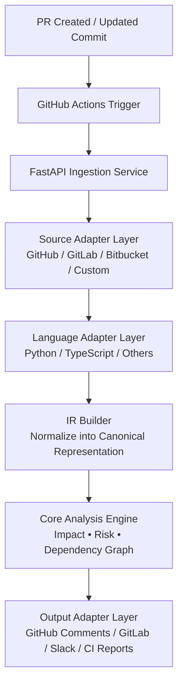

# Cystatic System Architecture

## High-Level Flow

```mermaid

flowchart TD
    A[PR Created / Updated Commit] --> B[GitHub Actions Trigger]

    B --> C[FastAPI Ingestion Service]

    C --> D[Source Adapter Layer<br/>GitHub / GitLab / Bitbucket / Custom]

    D --> E[Language Adapter Layer<br/>Python / TypeScript / Others]

    E --> F[IR Builder<br/>Normalize into Canonical Representation]

    F --> G[Core Analysis Engine<br/>Impact • Risk • Dependency Graph]

    G --> H[Output Adapter Layer<br/>GitHub Comments / GitLab / Slack / CI Reports]


```