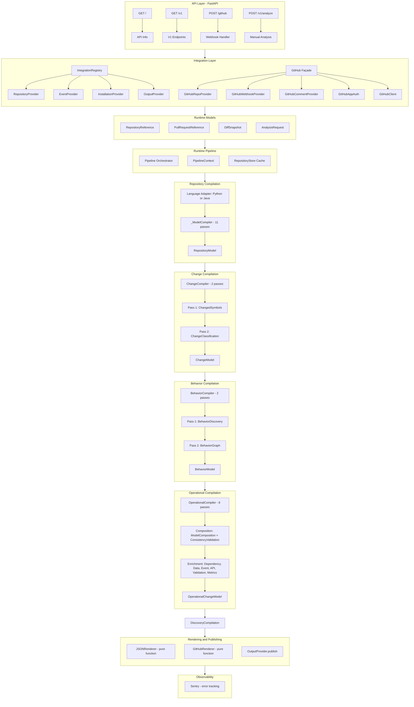

# Factor Architecture

## What Factor Does

Factor is a **blast-radius and refactor-risk analysis engine** for code changes. Given a PR (or raw diff), it determines which downstream services, endpoints, databases, and queues are impacted, assigns a confidence-weighted verdict, and posts a structured PR comment.

**Core principle:** Evidence-based progressive compression drives the verdict; the LLM is an expert reviewer.


---

## Architecture Diagrams

### High-Level System Architecture (Mermaid)



### Data Flow Through the Pipeline (Mermaid)

```mermaid
flowchart LR
    GIT[Git Repository] --> INT[Integration Layer]
    INT --> AR[AnalysisRequest]
    AR --> PL[Pipeline Orchestrator]
    PL --> P1[RepositoryModel]
    P1 --> P2[ChangeModel]
    P2 --> P3[BehaviorModel]
    P3 --> P4[OperationalChangeModel]
    P4 --> RENDER[Renderer - pure function]
    RENDER --> PUB[OutputProvider.publish to PR]

    style GIT fill:#e1f5fe
    style INT fill:#fff3e0
    style AR fill:#f3e5f5
    style PL fill:#fce4ec
    style P1 fill:#e8f5e9
    style P2 fill:#e8f5e9
    style P3 fill:#e8f5e9
    style P4 fill:#e8f5e9
    style RENDER fill:#fff8e1
    style PUB fill:#ffebee
```



### ASCII Architecture Diagram

```
┌──────────────────────────────────────────────────────────────────────────┐
│                         API Layer (FastAPI)                               │
│  ┌──────────────────────────────────────────────────────────────────┐    │
│  │  api/app.py — FastAPI application                                │    │
│  │  ├── GET  /        → API info                                    │    │
│  │  ├── GET  /v1      → V1 endpoint list                            │    │
│  │  ├── POST /github  → GitHub webhook (background tasks)           │    │
│  │  └── POST /v1/analyze → Manual analysis endpoint                 │    │
│  └──────────────────────────────────────────────────────────────────┘    │
└──────────────────────────────────────────────────────────────────────────┘
                               │
                               ▼
┌──────────────────────────────────────────────────────────────────────────┐
│                    Integration Layer (Platform-Agnostic)                  │
│                                                                          │
│  ┌──────────────────────────────────────────────────────────────────┐    │
│  │              IntegrationRegistry (Central Orchestrator)           │    │
│  │  ┌──────────────────────────────────────────────────────────┐    │    │
│  │  │  Manages 4 provider types by platform name:               │    │    │
│  │  │  - RepositoryProvider (fetch repo, diff, tree, commit)    │    │    │
│  │  │  - EventProvider (verify & parse webhook payloads)        │    │    │
│  │  │  - InstallationProvider (authenticate platform installs)  │    │    │
│  │  │  - OutputProvider (publish/update/delete results)         │    │    │
│  │  │  Lazy initialization + singleton pattern                  │    │    │
│  │  └──────────────────────────────────────────────────────────┘    │    │
│  └──────────────────────────────────────────────────────────────────┘    │
│                              │                                            │
│  ┌──────────────────────────────────────────────────────────────────┐    │
│  │              GitHubIntegration (Façade)                          │    │
│  │  ┌──────────┐  ┌──────────────┐  ┌──────────┐  ┌─────────────┐  │    │
│  │  │GitHubRepo│  │ GitHubWebhook│  │GitHubComm│  │GitHubInstall│  │    │
│  │  │Provider  │  │ Provider     │  │entProv.  │  │ Provider    │  │    │
│  │  │- fetch   │  │ - verify     │  │- publish  │  │(GitHubApp   │  │    │
│  │  │  repo    │  │ - parse      │  │- update   │  │ Auth)       │  │    │
│  │  │- fetch   │  │              │  │- delete   │  │             │  │    │
│  │  │  diff    │  │              │  │           │  │             │  │    │
│  │  │- fetch   │  │              │  │           │  │             │  │    │
│  │  │  file    │  │              │  │           │  │             │  │    │
│  │  │- fetch   │  │              │  │           │  │             │  │    │
│  │  │  tree    │  │              │  │           │  │             │  │    │
│  │  │- fetch   │  │              │  │           │  │             │  │    │
│  │  │  commit  │  │              │  │           │  │             │  │    │
│  │  └──────────┘  └──────────────┘  └──────────┘  └─────────────┘  │    │
│  │  Underlying: auth.py (JWT generation) + client.py (HTTP client) │    │
│  └──────────────────────────────────────────────────────────────────┘    │
│  Future: GitLab, Bitbucket, etc. (same interface, new implementation)     │
└──────────────────────────────────────────────────────────────────────────┘
                               │
                               ▼
┌──────────────────────────────────────────────────────────────────────────┐
│                    Runtime Models (Platform-Agnostic)                     │
│                                                                          │
│  ┌──────────────────┐  ┌──────────────────┐  ┌──────────────────────┐   │
│  │RepositoryReference│  │PullRequestReference│  │   DiffSnapshot       │   │
│  │- provider         │  │- number           │  │- files               │   │
│  │- owner            │  │- base_sha         │  │- hunks               │   │
│  │- repository       │  │- head_sha         │  │- additions           │   │
│  │- default_branch   │  │- title            │  │- deletions           │   │
│  └──────────────────┘  └──────────────────┘  └──────────────────────┘   │
│                                                                          │
│  ┌──────────────────────────────────────────────────────────────────┐    │
│  │                    AnalysisRequest                                │    │
│  │  - repository: RepositoryReference                                │    │
│  │  - pull_request: PullRequestReference | None                       │    │
│  │  - diff: DiffSnapshot | None                                       │    │
│  │  - trigger: AnalysisTrigger (pull_request, push, manual, scheduled) │   │
│  │  - metadata: dict[str, Any]                                        │    │
│  └──────────────────────────────────────────────────────────────────┘    │
└──────────────────────────────────────────────────────────────────────────┘
                               │
                               ▼
┌──────────────────────────────────────────────────────────────────────────┐
│                    Runtime Pipeline (Orchestration)                       │
│                                                                          │
│  ┌──────────────────────────────────────────────────────────────────┐    │
│  │  Pipeline class                                                  │    │
│  │  ┌────────────────────────────────────────────────────────────┐  │    │
│  │  │  1. Ensure Repository Model (cache hit → load, miss →      │  │    │
│  │  │     fetch snapshot via RepositoryProvider → detect language │  │    │
│  │  │     → create adapter → compile)                             │  │    │
│  │  │  2. Fetch Diff (from request or RepositoryProvider)          │  │    │
│  │  │  3. Compile Change Model (ChangeCompiler)                    │  │    │
│  │  │  4. Compile Behavior Model (BehaviorCompiler)                │  │    │
│  │  │  5. Compile Operational Model (OperationalCompiler)          │  │    │
│  │  │  6. Render (JSON or GitHub Markdown)                         │  │    │
│  │  │  7. Publish (via OutputProvider)                             │  │    │
│  │  └────────────────────────────────────────────────────────────┘  │    │
│  │                                                                  │    │
│  │  ┌────────────────────────────────────────────────────────────┐  │    │
│  │  │  PipelineContext (dataclass)                                │  │    │
│  │  │  Tracks: models, timing, errors, metadata                  │  │    │
│  │  │  Methods: mark_*_compiled() for timing instrumentation      │  │    │
│  │  └────────────────────────────────────────────────────────────┘  │    │
│  └──────────────────────────────────────────────────────────────────┘    │
│                                                                          │
│  ┌──────────────────────────────────────────────────────────────────┐    │
│  │  RepositoryStore (caching layer)                                 │    │
│  │  - load/save compiled RepositoryModels by (repo, ref)            │    │
│  │  - Avoids re-compiling unchanged repositories                    │    │
│  └──────────────────────────────────────────────────────────────────┘    │
└──────────────────────────────────────────────────────────────────────────┘
                               │
                               ▼
┌──────────────────────────────────────────────────────────────────────────┐
│                    Repository Compilation                                 │
│                    (Language Adapter Layer)                               │
│                                                                          │
│  ┌──────────────────────────────────────────────────────────────────┐    │
│  │  BaseLanguageAdapter (abstract)                                  │    │
│  │  ├── compile(repository_input) → RepositoryModel                 │    │
│  │  ├── get_language() → str ("python", "java", etc.)               │    │
│  │  └── get_compiler_passes() → list[str]                           │    │
│  │                                                                  │    │
│  │  ┌──────────────────────┐  ┌──────────────────────────────────┐  │    │
│  │  │ PythonAdapter        │  │ JavaAdapter                      │  │    │
│  │  │ - AST parsing        │  │ - Java parser (Tree-sitter)      │  │    │
│  │  │ - Framework detect   │  │ - Framework detect               │  │    │
│  │  │   (FastAPI/Flask/    │  │   (Spring Boot/JPA)              │  │    │
│  │  │    Django/SQLAlchemy)│  │                                  │  │    │
│  │  └──────────┬───────────┘  └──────────────────────────────────┘  │    │
│  │             │                                                     │    │
│  │             ▼                                                     │    │
│  │  ┌──────────────────────────────────────────────────────────┐    │    │
│  │  │  _ModelCompiler (11 passes — internal to adapters)       │    │    │
│  │  │  Input:  Semantic graph (file_path → extracted data)     │    │    │
│  │  │  Output: RepositoryModel (language-agnostic)             │    │    │
│  │  │                                                          │    │    │
│  │  │  Pass  1: Symbol Collection (functions, classes, methods)│    │    │
│  │  │  Pass  2: Reference Resolution (import → symbol links)   │    │    │
│  │  │  Pass  3: Call Graph (caller → callee edges)              │    │    │
│  │  │  Pass  4: Endpoint Discovery (REST routes)               │    │    │
│  │  │  Pass  5: Type Relationships (inheritance, composition)  │    │    │
│  │  │  Pass  6: Async Entry Points (workers, queues)           │    │    │
│  │  │  Pass  7: Persistence Models (ORM models, tables)        │    │    │
│  │  │  Pass  8: Repository Methods (data access methods)       │    │    │
│  │  │  Pass  9: Event Constructs (publish/subscribe)           │    │    │
│  │  │  Pass 10: Test Definitions (test functions, classes)     │    │    │
│  │  │  Pass 11: Configuration References (env vars, config)    │    │    │
│  │  └──────────────────────────────────────────────────────────┘    │    │
│  │                                                                  │    │
│  │  Language-specific extractors per language produce the           │    │
│  │  semantic graph consumed by _ModelCompiler:                       │    │
│  │  - symbols/, calls/, imports/, types/, entrypoints/              │    │
│  │  - persistence/, events/, configuration/, tests/                 │    │
│  └──────────────────────────────────────────────────────────────────┘    │
└──────────────────────────────────────────────────────────────────────────┘
                               │
                               ▼
┌──────────────────────────────────────────────────────────────────────────┐
│                    Change Compilation                                      │
│                                                                          │
│  ┌──────────────────────────────────────────────────────────────────┐    │
│  │  ChangeCompiler                                                  │    │
│  │  Input:  diff_data + old RepositoryModel + new RepositoryModel   │    │
│  │  Output: ChangeModel (frozen dataclass)                          │    │
│  │  ┌──────────────────────────────────────────────────────────┐    │    │
│  │  │  Pass 1: ChangedSymbolsPass                               │    │    │
│  │  │  - Computes O(1) set difference: added ∩ removed ∩        │    │    │
│  │  │    modified symbols between old and new RepositoryModels   │    │    │
│  │  │  - Tracks changed imports and endpoints                    │    │    │
│  │  │                                                              │    │    │
│  │  │  Pass 2: ChangeClassificationPass                          │    │    │
│  │  │  - Classifies each changed symbol into change types:        │    │    │
│  │  │    FunctionBodyChange, SignatureChange, VisibilityChange,   │    │    │
│  │  │    DecoratorChange, SuperclassChange, InterfaceChange,      │    │    │
│  │  │    EndpointAnnotationChange                                 │    │    │
│  │  └──────────────────────────────────────────────────────────┘    │    │
│  └──────────────────────────────────────────────────────────────────┘    │
└──────────────────────────────────────────────────────────────────────────┘
                               │
                               ▼
┌──────────────────────────────────────────────────────────────────────────┐
│                    Behavior Compilation                                    │
│                                                                          │
│  ┌──────────────────────────────────────────────────────────────────┐    │
│  │  BehaviorCompiler                                                │    │
│  │  Input:  ChangeModel + RepositoryModel                           │    │
│  │  Output: BehaviorModel (frozen dataclass)                        │    │
│  │  ┌──────────────────────────────────────────────────────────┐    │    │
│  │  │  Pass 1: BehaviorDiscoveryPass                           │    │    │
│  │  │  - Traces call graph from changed symbols outward         │    │    │
│  │  │  - Identifies affected behaviors (endpoints, workers,    │    │    │
│  │  │    scheduled tasks, event handlers)                      │    │    │
│  │  │  - Assigns confidence scores based on distance            │    │    │
│  │  │                                                          │    │    │
│  │  │  Pass 2: BehaviorGraphPass                               │    │    │
│  │  │  - Builds execution_graphs (control flow paths) for       │    │    │
│  │  │    each affected behavior                                 │    │    │
│  │  │  - Traces the complete call path from entry point         │    │    │
│  │  │    through affected symbols                               │    │    │
│  │  └──────────────────────────────────────────────────────────┘    │    │
│  └──────────────────────────────────────────────────────────────────┘    │
└──────────────────────────────────────────────────────────────────────────┘
                               │
                               ▼
┌──────────────────────────────────────────────────────────────────────────┐
│                    Operational Compilation                                 │
│                                                                          │
│  ┌──────────────────────────────────────────────────────────────────┐    │
│  │  OperationalCompiler (8 passes)                                  │    │
│  │  Input:  RepositoryModel + ChangeModel + BehaviorModel           │    │
│  │  Output: OperationalChangeModel                                  │    │
│  │                                                                  │    │
│  │  Composition group                                               │    │
│  │  ┌──────────────────────────────────────────────────────────┐    │    │
│  │  │  Pass 1: ModelCompositionPass                             │    │    │
│  │  │  - Composes all 3 input models into a single unified model │    │    │
│  │  │  - Cross-references symbols across models                  │    │    │
│  │  │                                                            │    │    │
│  │  │  Pass 2: ConsistencyValidationPass                         │    │    │
│  │  │  - Validates internal consistency of composed model        │    │    │
│  │  │  - Detects orphaned references, missing imports            │    │    │
│  │  │  - May raise ValueError if validation fails                │    │    │
│  │  └──────────────────────────────────────────────────────────┘    │    │
│  │                                                                  │    │
│  │  Enrichment group (all optional, graceful degrade)               │    │
│  │  ┌──────────────────────────────────────────────────────────┐    │    │
│  │  │  Pass 3: DependencyCompilationPass                        │    │    │
│  │  │  - Maps changed symbols to downstream dependencies        │    │    │
│  │  │                                                            │    │    │
│  │  │  Pass 4: DataCompilationPass                              │    │    │
│  │  │  - Identifies data model changes (schema migrations,      │    │    │
│  │  │    column changes, relationship changes)                  │    │    │
│  │  │                                                            │    │    │
│  │  │  Pass 5: EventCompilationPass                             │    │    │
│  │  │  - Detects changes to event publish/subscribe patterns    │    │    │
│  │  │                                                            │    │    │
│  │  │  Pass 6: APICompilationPass                               │    │    │
│  │  │  - Analyzes API contract changes (routes, methods,        │    │    │
│  │  │    request/response shapes)                               │    │    │
│  │  │                                                            │    │    │
│  │  │  Pass 7: ValidationCompilationPass                        │    │    │
│  │  │  - Identifies changes to validation logic                 │    │    │
│  │  │                                                            │    │    │
│  │  │  Pass 8: MetricsCompilationPass                           │    │    │
│  │  │  - Computes discovery metrics (blast radius,              │    │    │
│  │  │    confidence scores, risk indicators)                    │    │    │
│  │  └──────────────────────────────────────────────────────────┘    │    │
│  └──────────────────────────────────────────────────────────────────┘    │
└──────────────────────────────────────────────────────────────────────────┘
                               │
                               ▼
┌──────────────────────────────────────────────────────────────────────────┐
│                    Rendering & Publishing                                │
│                                                                          │
│  ┌──────────────┐   ┌──────────────────┐   ┌───────────────────────┐    │
│  │JSONRenderer  │   │ GitHubRenderer   │   │ OutputProvider        │    │
│  │(pure func)   │   │ (pure function)  │   │ (publish via comment, │    │
│  │→ dict output │   │ → Markdown str   │   │  update, delete)      │    │
│  └──────────────┘   └──────────────────┘   └───────────────────────┘    │
└──────────────────────────────────────────────────────────────────────────┘
                               │
                               ▼
┌──────────────────────────────────────────────────────────────────────────┐
│                    Observability (Sentry)                                 │
│  ┌──────────────────────────────────────────────────────────────────┐    │
│  │  instrumentation/sentry/                                         │    │
│  │  - Sentry integration for error tracking                         │    │
│  │  - Per-request context (repo, PR, run ID) via contexts.py        │    │
│  └──────────────────────────────────────────────────────────────────┘    │
└──────────────────────────────────────────────────────────────────────────┘
```

---

## Compilation Pipeline Overview

The system uses a **compilation pipeline** where each stage produces a deterministic, immutable model consumed by the next:

| Stage | Name | Input | Output | Compiler |
|-------|------|-------|--------|----------|
| 1 | Repository | Source code files | `RepositoryModel` | Language Adapter (`_ModelCompiler` with 11 passes) |
| 2 | Change | Diff + old/new RepositoryModels | `ChangeModel` | `ChangeCompiler` (2 passes) |
| 3 | Behavior | ChangeModel + RepositoryModel | `BehaviorModel` | `BehaviorCompiler` (2 passes) |
| 4 | Operational | RepositoryModel + ChangeModel + BehaviorModel | `OperationalChangeModel` | `OperationalCompiler` (8 passes) |

### Data Flow Through the Pipeline

```
                  ┌──────────────────┐
                  │  Git Repository  │
                  └────────┬─────────┘
                           │
                 ┌─────────▼──────────┐
                 │ Integration Layer  │
                 │ (GitHubProvider)   │
                 │ - fetch_repository │
                 │ - fetch_diff       │
                 └─────────┬──────────┘
                           │
              ┌────────────▼─────────────┐
              │  Runtime Models           │
              │  AnalysisRequest {        │
              │    repository,            │
              │    pull_request?,         │
              │    diff?                  │
              │  }                        │
              └────────────┬──────────────┘
                           │
              ┌────────────▼──────────────┐
              │  Pipeline (orchestrator)  │
              │  PipelineContext (state)  │
              └────────────┬──────────────┘
                           │
              ┌────────────▼──────────────┐
              │  Repository Compilation   │
              │  detect_language → create_│
              │  adapter → compile()       │
              │  → RepositoryModel         │
              └────────────┬──────────────┘
                           │
              ┌────────────▼──────────────┐
              │  Change Compilation       │
              │  ChangedSymbolsPass →     │
              │  ChangeClassificationPass │
              │  → ChangeModel            │
              └────────────┬──────────────┘
                           │
              ┌────────────▼──────────────┐
              │  Behavior Compilation     │
              │  BehaviorDiscoveryPass →  │
              │  BehaviorGraphPass        │
              │  → BehaviorModel          │
              └────────────┬──────────────┘
                           │
              ┌────────────▼──────────────┐
              │  Operational Compilation  │
              │  ModelComposition →       │
              │  ConsistencyValidation →  │
              │  Dependency → Data →      │
              │  Event → API → Validation │
              │  → Metrics                │
              │  → OperationalChangeModel │
              └────────────┬──────────────┘
                           │
              ┌────────────▼──────────────┐
              │  Engineering Discovery     │
              │  Compilation               │
              │  → EngineeringDiscovery    │
              │    Model (Canonical IR)    │
              └────────────┬──────────────┘
                           │
              ┌────────────▼──────────────┐
              │  Renderer + OutputProvider│
              │  → JSON or GitHub Markdown│
              │  → Publish to PR comment  │
              └───────────────────────────┘
```

---

## Data Model Summary

### Runtime Models (`runtime/models/`)

| Model | Fields | Purpose |
|-------|--------|---------|
| `RepositoryReference` | provider, owner, repository, default_branch | Identifies a repository |
| `PullRequestReference` | number, base_sha, head_sha, title | Identifies a PR |
| `DiffSnapshot` | files (list of DiffFile) | Raw diff between two commits |
| `DiffFile` | file_path, added_lines, removed_lines, hunks | Single file diff |
| `DiffHunk` | source_start, source_length, target_start, target_length, lines | Hunk-level diff |
| `RepositorySnapshot` | files (dict), commit_sha, default_branch | Full repository state |
| `AnalysisRequest` | repository, pull_request?, diff?, trigger, metadata | Pipeline input |

### Language-Agnostic Models (`language_adapters/model/`)

| Model | Fields | Purpose |
|-------|--------|---------|
| `RepositoryModel` | symbols, call_graph, reference_graph, type_relationship_graph, entry_points, async_entry_points, persistence_models, repository_methods, event_constructs, test_definitions, configuration_references | Complete repository representation |
| `Symbol` | id, name, kind, language, file, range, visibility, evidence, properties | A symbol (function, class, method, import) |
| `CallGraph` | edges (list of CallEdge) | Caller → callee relationships |
| `ReferenceGraph` | edges (list of ReferenceEdge) | Import resolution edges |
| `TypeRelationshipGraph` | edges (list of TypeRelationshipEdge) | Inheritance, composition |
| `EntryPoint` | kind, route, handler_id, evidence, metadata | REST endpoint |
| `AsyncEntryPoint` | kind, handler_id, trigger, framework, evidence, metadata | Worker, queue, scheduled task |
| `PersistenceModel` | symbol_id, name, kind, table_name, framework, fields, relationships | ORM model / table |
| `RepositoryMethod` | symbol_id, name, kind, model_symbol_id, framework, query | Data access method |
| `EventConstruct` | symbol_id, operation_kind, event_name, framework | Publish / subscribe |
| `TestDefinition` | symbol_id, name, kind, framework, fixtures, assertions | Test function/class |
| `ConfigurationReference` | symbol_id, config_key, kind, default_value | Environment variable / config |

### Change Models (`change/model/`)

| Model | Fields | Purpose |
|-------|--------|---------|
| `ChangeModel` | added_symbols, removed_symbols, modified_symbols, changed_imports, changed_endpoints | Complete change representation |
| `ModifiedSymbol` | symbol, changes (tuple of change types) | A symbol with classified changes |
| Change Types | FunctionBodyChange, SignatureChange, VisibilityChange, DecoratorChange, SuperclassChange, InterfaceChange, EndpointAnnotationChange | Specific change classifications |
| `ImportChange` | file, old_import, new_import, change_type | Import statement changes |
| `EndpointChange` | symbol_id, old_endpoint, new_endpoint, old_method, new_method, change_type | API endpoint changes |

### Behavior Models (`behavior/model/`)

| Model | Fields | Purpose |
|-------|--------|---------|
| `BehaviorModel` | behaviors, execution_graphs | Affected behaviors and traces |
| `Behavior` | id, type, affected_symbols, confidence_score, impact_path | An affected behavior |
| `ExecutionGraph` | nodes, edges, entry_point, affected_symbols | Control flow path for a behavior |

### Operational Models (`operational/model/`)

| Model | Fields | Purpose |
|-------|--------|---------|
| `OperationalChangeModel` | change, behavior, dependency, data, event, api, validation, metrics | Final enriched model with all analysis dimensions |

---

## Key Architectural Patterns

### 1. Provider Pattern
All external service interactions are abstracted behind 4 provider interfaces:
- **`RepositoryProvider`** — Fetches repository data (snapshot, diff, files, tree, commits)
- **`EventProvider`** — Verifies webhook signatures and parses platform events into `AnalysisRequest`
- **`InstallationProvider`** — Authenticates platform installations (e.g., GitHub App JWT tokens)
- **`OutputProvider`** — Publishes, updates, and deletes analysis results

Each interface is defined as an `ABC` in `integrations/base/`. Platform implementations (GitHub, future GitLab, etc.) implement these interfaces. The pipeline never depends on platform-specific code.

### 2. Integration Registry
The `IntegrationRegistry` (singleton in `integrations/base/registry.py`) manages all providers by platform name:
```python
registry.register("github", repository_provider=..., event_provider=..., ...)
provider = registry.get_repository_provider("github")
```
This enables the pipeline and API layer to work with any platform without knowing which one is active.

### 3. GitHub Integration Façade
`GitHubIntegration` (`integrations/github/provider.py`) composes 5 internal components:
- `GitHubAppAuth` — JWT token generation for GitHub App authentication
- `GitHubClient` — HTTP client wrapper (GET/POST/DELETE to GitHub API)
- `GitHubRepositoryProvider` — Implements `RepositoryProvider` for GitHub
- `GitHubWebhookProvider` — Implements `EventProvider` for GitHub webhooks
- `GitHubCommentProvider` — Implements `OutputProvider` for PR comments

The façade provides a single `register(registry)` entry point.

### 4. Compiler Isolation
Compiler modules (`behavior/`, `change/`, `operational/`, `language_adapters/`) have zero imports from integration or API layers. They depend only on language-agnostic models and produce deterministic, immutable outputs.

### 5. Pass-Based Architecture
Each compiler executes a sequence of passes. Each pass:
- Has a single responsibility
- Transforms a shared pass context
- Is independently testable
- Produces a deterministic output

Passes communicate through a pass context object (e.g., `ChangePassContext`, `BehaviorPassContext`, `OperationalPassContext`) that accumulates data as it flows through the pipeline.

### 6. Language-Agnostic Core
- Language adapters (`language_adapters/python/`, `language_adapters/java/`) produce a common semantic graph format
- The `_ModelCompiler` (internal to adapters) transforms this into a language-agnostic `RepositoryModel`
- All subsequent stages operate on `RepositoryModel` — they never see parser-specific ASTs
- New languages can be added by implementing `BaseLanguageAdapter` + language-specific extractors

### 7. Deterministic Models
All models (`RepositoryModel`, `ChangeModel`, `BehaviorModel`, `OperationalChangeModel`) are implemented as frozen dataclasses (or use frozensets/tuples for immutability). This ensures:
- No side effects between stages
- Safe caching
- Reproducible analysis

### 8. Graceful Degradation
Optional enrichment models (dependency, data, event, api, validation, metrics) are optional. If any analysis pass fails, the system degrades gracefully and proceeds with available data.

### 9. Pure Renderers
Renderers (`json_renderer.py`, `github_renderer.py`) are pure functions:
- Input: `OperationalChangeModel`
- Output: Dict or Markdown string
- No side effects, no API calls
- The `OutputProvider` handles all external communication

### 10. Pipeline Context
The `PipelineContext` dataclass (`runtime/pipeline/context.py`) tracks all intermediate state through the pipeline execution:
- Input: repository, base_sha, head_sha, diff_data
- Models: repository_model, change_model, behavior_model, ocm
- Metadata: language, adapter, request_id, installation_id
- Timing: auto-recorded timestamps for each stage
- Errors: captured without crashing the pipeline

---

## Entry Points

### Webhook (GitHub PR Events)
```
POST /github
├── Verify webhook signature via EventProvider.verify()
├── Parse payload into AnalysisRequest via EventProvider.parse()
├── Filter for allowed PR actions (opened, reopened, synchronize, ready_for_review)
├── Schedule background task → _process_pr_analysis()
│   ├── Run pipeline (all stages)
│   ├── Render result
│   └── Publish comment via OutputProvider.publish()
└── Return 202 Accepted
```

### Manual Analysis API
```
POST /v1/analyze
├── Accept PR URL or structured data (repository + optional diff)
├── If PR URL: fetch PR details via GitHub API
├── Build AnalysisRequest
├── Run pipeline (all stages)
├── Render JSON result
└── Return full analysis response
```

---

## Error Handling

Errors are organized by domain in `errors/`:

| Module | Errors |
|--------|--------|
| `authentication.py` | `AuthenticationError` |
| `pipeline.py` | `PipelineError`, `PipelineExecutionError` |
| `renderer.py` | `RendererError`, `RenderingError` |
| `repository.py` | `RepositoryError`, `RepositoryNotFound`, `RepositoryAccessDenied` |
| `webhook.py` | `WebhookError`, `WebhookVerificationError` |

Runtime-specific errors in `runtime/errors.py`:
- `RepositoryNotInstalled`, `RepositoryNotSupported`, `RepositoryCompilationFailed`
- `DiffFetchFailed`, `InvalidDiff`
- `LanguageDetectionFailed`, `LanguageNotSupported`
- `CompilationTimeout`
- `InvalidWebhook`, `MissingWebhookPayload`

---

## Technology Stack

| Component | Technology |
|-----------|-----------|
| Language | Python 3.12+ |
| Framework | FastAPI |
| Data Models | Frozen dataclasses |
| Testing | pytest |
| Static Analysis | Python AST (built-in), Java parser (Tree-sitter based) |
| VCS Integration | GitHub API (pluggable for GitLab, etc.) |
| Observability | Sentry |
| Package Management | uv + pyproject.toml |
| Code Quality | mypy (strict), pytest |

---

## Directory Structure

```
factor-api/
│
├── runtime/                      Runtime layer (platform-agnostic orchestration)
│   ├── models/                   Runtime data models
│   │   ├── repository.py         RepositoryReference, RepositorySnapshot
│   │   ├── pull_request.py       PullRequestReference
│   │   ├── diff.py               DiffSnapshot, DiffFile, DiffHunk
│   │   └── analysis.py           AnalysisRequest, AnalysisTrigger
│   ├── pipeline/                 Runtime orchestration
│   │   ├── pipeline.py           Pipeline (orchestrates compilation stages)
│   │   └── context.py            PipelineContext (runtime state tracking)
│   ├── renderers/                Output formatters (pure functions)
│   │   ├── json_renderer.py      JSON format renderer
│   │   └── github_renderer.py    GitHub Markdown renderer
│   ├── storage/                  Data persistence
│   │   └── repository_store.py   Repository snapshot caching
│   ├── language/                 Language detection
│   │   └── detection.py          LanguageAdapterFactory, get_language_factory
│   └── errors.py                 Runtime-specific error imports
│
├── integrations/                 Platform integrations
│   ├── base/                     Provider interfaces and registry
│   │   ├── repository_provider.py    RepositoryProvider ABC
│   │   ├── event_provider.py         EventProvider ABC
│   │   ├── installation_provider.py  InstallationProvider ABC
│   │   ├── output_provider.py        OutputProvider ABC
│   │   └── registry.py               IntegrationRegistry + singleton
│   └── github/                   GitHub integration
│       ├── provider.py           GitHubIntegration (façade)
│       ├── repositories.py       GitHubRepositoryProvider
│       ├── webhooks.py           GitHubWebhookProvider
│       ├── comments.py           GitHubCommentProvider
│       ├── auth.py               GitHubAppAuth (JWT generation)
│       ├── client.py             GitHubClient (HTTP wrapper)
│       └── routes.py             FastAPI routes for webhook + /v1/analyze
│
├── language_adapters/            Per-language static analysis
│   ├── base/                     Base classes and shared compiler
│   │   ├── adapter.py            BaseLanguageAdapter (abstract)
│   │   ├── compiler.py           _ModelCompiler (11 passes, internal)
│   │   ├── extractor.py          Base extractor interface
│   │   ├── normalization.py      Data normalization utilities
│   │   └── parser.py             Base parser interface
│   ├── model/                    Language-agnostic data models
│   │   ├── repository_model.py   RepositoryModel
│   │   ├── symbol.py             Symbol, SymbolKind, SymbolVisibility
│   │   ├── graphs.py             CallGraph, ReferenceGraph, TypeRelationshipGraph
│   │   ├── configuration.py      ConfigurationReference, ConfigReferenceKind
│   │   ├── events.py             EventConstruct, EventOperationKind
│   │   ├── persistence.py        PersistenceModel, PersistenceModelKind, RepositoryMethod
│   │   ├── tests.py              TestDefinition, TestFramework, TestFixture
│   │   └── evidence.py           Evidence, FileLocation, ImportReference, CallReference
│   ├── python/                   Python adapter
│   │   ├── adapter.py            PythonLanguageAdapter
│   │   ├── parser/               Python AST parser
│   │   └── extractors/           Python-specific extractors (9 categories)
│   │       ├── calls/            Function call extraction
│   │       ├── configuration/    Config/env var extraction
│   │       ├── entrypoints/      REST endpoint extraction (FastAPI, Flask, Django)
│   │       ├── events/           Event publish/subscribe extraction
│   │       ├── imports/          Import statement extraction
│   │       ├── persistence/      ORM model extraction (SQLAlchemy, Django)
│   │       ├── symbols/          Symbol (function/class/method) extraction
│   │       ├── tests/            Test definition extraction (pytest, unittest)
│   │       └── types/            Type relationship extraction
│   └── java/                     Java adapter
│       ├── adapter.py            JavaLanguageAdapter
│       ├── parser/               Java parser (Tree-sitter based)
│       └── extractors/           Java-specific extractors (9 categories)
│           ├── calls/
│           ├── configuration/
│           ├── entrypoints/      Spring Boot REST endpoints
│           ├── events/
│           ├── imports/
│           ├── persistence/      JPA entities
│           ├── symbols/
│           ├── tests/            JUnit tests
│           └── types/
│
├── change/                       Change Compilation
│   ├── compiler/
│   │   ├── compiler.py           ChangeCompiler (orchestrates 2 passes)
│   │   └── passes/
│   │       ├── base.py           ChangePassContext, ChangeCompilerPass
│   │       ├── changed_symbols/    ChangedSymbolsPass (O(1) set diff)
│   │       └── change_classification/ ChangeClassificationPass
│   └── model/
│       ├── change_model.py       ChangeModel (frozen dataclass)
│       └── changes.py            Change types (FunctionBodyChange, SignatureChange, etc.)
│
├── behavior/                     Behavior Compilation
│   ├── compiler/
│   │   ├── compiler.py           BehaviorCompiler (orchestrates 2 passes)
│   │   └── passes/
│   │       ├── base.py           BehaviorPassContext, BehaviorCompilerPass
│   │       ├── behavior_discovery/ BehaviorDiscoveryPass
│   │       └── behavior_graph/     BehaviorGraphPass
│   └── model/
│       ├── behavior_model.py     BehaviorModel
│       ├── behavior.py           Behavior
│       └── execution_graph.py    ExecutionGraph
│
├── operational/                  Operational Compilation
│   ├── compiler/
│   │   ├── compiler.py           OperationalCompiler (orchestrates 8 passes)
│   │   └── passes/
│   │       ├── base.py           OperationalPassContext, OperationalCompilerPass
│   │       ├── model_composition/     ModelCompositionPass
│   │       ├── consistency_validation/ ConsistencyValidationPass
│   │       ├── dependency/            DependencyCompilationPass
│   │       ├── data/                  DataCompilationPass
│   │       ├── events/                EventCompilationPass
│   │       ├── api/                   APICompilationPass
│   │       ├── validation/            ValidationCompilationPass
│   │       └── metrics/               MetricsCompilationPass
│   └── model/
│       └── model.py              OperationalChangeModel
│
├── api/                          API layer (FastAPI)
│   ├── app.py                    FastAPI application + routes
│   ├── settings.py               API configuration (pydantic-settings)
│   ├── routes/
│   │   └── health.py             Health check endpoint
│   └── schemas/
│       └── github.py             GitHub request/response schemas
│
├── errors/                       Error models
│   ├── __init__.py               Error exports
│   ├── authentication.py         AuthenticationError
│   ├── pipeline.py               PipelineError, PipelineExecutionError
│   ├── renderer.py               RendererError, RenderingError
│   ├── repository.py             RepositoryError, RepositoryNotFound, RepositoryAccessDenied
│   └── webhook.py                WebhookError, WebhookVerificationError
│
├── instrumentation/              Observability
│   ├── __init__.py
│   └── sentry/
│       ├── __init__.py
│       ├── sentry.py             Sentry initialization
│       └── contexts.py           Per-request context (repo, PR, run ID)
│
├── templates/                    PR comment templates
│   └── github_comment.md         GitHub comment template (Jinja2/Markdown)
│
├── tests/                        Test suite
│   ├── test_repository_compiler.py   Repository compilation tests
│   ├── test_change_compiler.py       Change compilation tests
│   ├── test_behavior_compiler.py     Behavior compilation tests
│   └── test_operational_compiler.py  Operational compilation tests
│
├── pyproject.toml                Project configuration
├── uv.lock                       uv lock file
├── pytest.ini                    pytest configuration
├── mypy.ini                      mypy configuration
├── .clinerules                   Agent rules (engineering standards)
├── .gitignore
└── README.md                     Project overview
```

---

## Summary

Factor uses a **compilation pipeline** where each stage produces a deterministic, immutable model:

1. **Repository** — Language adapters parse source code through extractors, and the `_ModelCompiler` (11 passes) builds a language-agnostic `RepositoryModel` with symbols, call graphs, endpoints, persistence models, and more.
2. **Change** — The `ChangeCompiler` (2 passes: changed symbols + classification) compares old and new repository snapshots to produce a `ChangeModel` describing exactly what changed.
3. **Behavior** — The `BehaviorCompiler` (2 passes: discovery + graph) traces the impact of changes through the call graph to identify affected behaviors and execution paths.
4. **Operational** — The `OperationalCompiler` (8 passes: composition, validation, dependency, data, event, API, validation, metrics) composes all models and enriches them with operational impact analysis.
5. **Engineering Discovery** — The `EngineeringDiscoveryCompiler` (6 enrichment passes + projection) projects the OperationalChangeModel into an `EngineeringDiscoveryModel` — the deterministic, immutable canonical IR that all renderers consume.


The runtime pipeline (`Pipeline` class) orchestrates the entire flow:
1. Receives `AnalysisRequest` from API or webhook
2. Loads or compiles the `RepositoryModel` (with caching via `RepositoryStore`)
3. Fetches the diff
4. Runs all compilation stages
5. Renders the result via a pure renderer
6. Publishes via the configured `OutputProvider`

The architecture is designed for **modularity, determinism, and extensibility** — each stage, pass, and provider can be developed, tested, and debugged independently. The provider pattern ensures new platforms can be added without modifying the compilation pipeline.