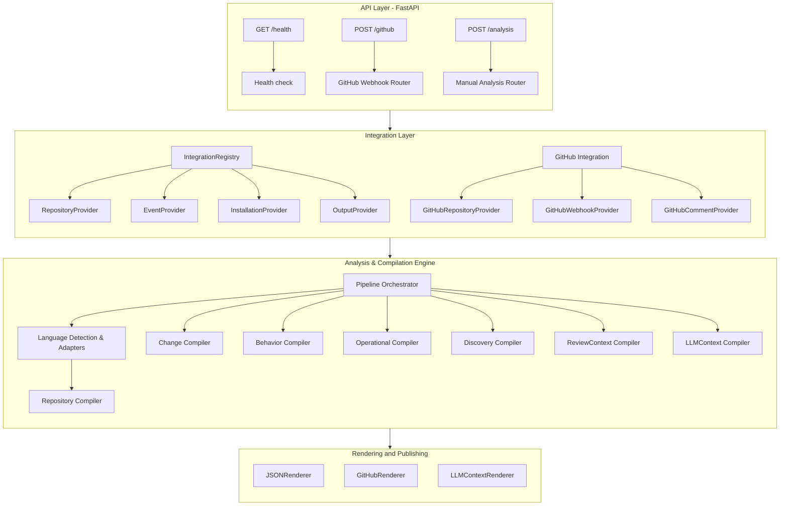

# Factor Architecture

## What Factor Does

Factor is a **blast-radius and refactor-risk analysis engine** for code changes. Given a pull request (or a raw diff), it determines which downstream services, endpoints, databases, queues, and event subscription models are impacted, compiles behavioral and operational change indicators, and prepares a structured review context for an LLM expert reviewer to produce a confidence-weighted verdict.

---

## System Architecture Diagram



---

## The 9-Step Compilation Pipeline

The runtime pipeline is orchestrated by the `Pipeline` class located in [engine/pipeline/pipeline.py](file:///Users/jishnupsamal/Jishnu/Factor/cystatic-core/engine/pipeline/pipeline.py). It progresses through the following sequential stages:

```
                   ┌──────────────────┐
                   │  Git Repository  │
                   └────────┬─────────┘
                            │
                  ┌─────────▼──────────┐
                  │ Integration Layer  │
                  │ (GitHubProvider)   │
                  └─────────┬──────────┘
                            │
               ┌────────────▼─────────────┐
               │     AnalysisRequest      │
               └────────────┬──────────────┘
                            │
               ┌────────────▼──────────────┐
               │    Pipeline Orchestrator  │
               └────────────┬──────────────┘
                            │
      ┌─────────────────────┴─────────────────────┐
      │  Step 1: Repository Model Compilation      │
      │  - Compile base and head RepositoryModels │
      │  - Employs cache via RepositoryStore      │
      └─────────────────────┬─────────────────────┘
                            │
      ┌─────────────────────▼─────────────────────┐
      │  Step 2: Fetch Diff Data                  │
      │  - Parse file diffs and hunks             │
      └─────────────────────┬─────────────────────┘
                            │
      ┌─────────────────────▼─────────────────────┐
      │  Step 3: Change Compilation               │
      │  - ChangedSymbolsPass + Classification    │
      └─────────────────────┬─────────────────────┘
                            │
      ┌─────────────────────▼─────────────────────┐
      │  Step 4: Behavior Compilation             │
      │  - Trace call graphs, discover behaviors  │
      └─────────────────────┬─────────────────────┘
                            │
      ┌─────────────────────▼─────────────────────┐
      │  Step 5: Operational Compilation          │
      │  - Compose models and cross-enrich        │
      │  - DB schema, Event pub/sub, API checks   │
      └─────────────────────┬─────────────────────┘
                            │
      ┌─────────────────────▼─────────────────────┐
      │  Step 6: Engineering Discovery Model      │
      │  - Project findings into canonical IR     │
      └─────────────────────┬─────────────────────┘
                            │
      ┌─────────────────────▼─────────────────────┐
      │  Step 7: Discovery IR Compilation         │
      │  - Run deep rule-based analysis passes    │
      └─────────────────────┬─────────────────────┘
                            │
      ┌─────────────────────▼─────────────────────┐
      │  Step 8: ReviewContext Compilation        │
      │  - Collect and format review data         │
      └─────────────────────┬─────────────────────┘
                            │
      ┌─────────────────────▼─────────────────────┐
      │  Step 9: LLMContext Compilation           │
      │  - Build compressed LLM review packages   │
      └───────────────────────────────────────────┘
```

### Step 1: Repository Compilation
Fetches code tree snapshots for both the **base** and **head** references and compiles them into a unified semantic graph representation (`RepositoryModel`). 
- Uses automatic language detection (supporting **Python**, **Java**, and **TypeScript**).
- Parses syntax trees (ASTs or Tree-sitter objects) to extract symbols, call graphs, imports, database persistence tables, entry points, tests, event constructs, and configuration parameters.
- Uses `RepositoryStore` to cache compiled repository states and skip parsing unmodified code references.

### Step 2: Fetch Diff Data
Fetches the raw diff files and line hunks representing the changes introduced by the pull request.

### Step 3: Change Compilation
The `ChangeCompiler` compares the base and head models to compute the delta:
- **ChangedSymbolsPass:** Evaluates modifications at the symbol level (added, modified, or removed classes, methods, and imports).
- **ChangeClassificationPass:** Categorizes changes (e.g., changes to function body, method signatures, visibility modifiers, decorators, or REST endpoint annotations).

### Step 4: Behavior Compilation
The `BehaviorCompiler` traces downstream call relationships starting from the changed symbols to identify impacted code execution pathways:
- Traces control and call flow graphs outward to entry points.
- Determines the confidence and depth of impact.

### Step 5: Operational Compilation
The `OperationalCompiler` merges change delta and behavior insights, performing optional domain-specific enrichments:
- **API Pass:** Detects additions or breakages in HTTP contracts.
- **Data Pass:** Tracks changes to database schemas, models, or active query structures.
- **Event Pass:** Traces publish/subscribe updates.
- **Dependency & Metrics Pass:** Flags overall blast radius and confidence indicators.

### Step 6 & 7: Engineering Discovery & Discovery IR Compilation
Compiles the findings into a canonical intermediate representation (`EngineeringDiscoveryModel`) and runs dedicated rule-based detection passes:
- Detects boundary-crossing control transfers, deep execution changes, hidden relationships, state mutations, shared dependencies, and validation gaps.

### Step 8 & 9: ReviewContext & LLMContext Compilation
Prepares and packages contextual review documents containing specific code symbols and formatted diffs for prompt injection. Uses token count estimators to structure compact context packages for the reviewing LLM.

---

## Key Directory Structure

```
cystatic-core/
├── api/                         # FastAPI application layer
│   ├── routes/                  # Routers: /health, /github webhook, /analysis manual triggers
│   ├── schemas/                 # Pydantic web verification & payload schemas
│   ├── deps.py                  # Dependency injection utilities
│   └── main.py                  # Application initialization
│
├── core/                        # Core system utilities
│   ├── config.py                # Environment configurations (pydantic-settings)
│   ├── db.py                    # Database connection pool setup
│   ├── errors.py                # System-wide custom exception definitions
│   ├── logging.py               # Time logging & runtime execution tracing utilities
│   ├── profile.py               # Memory & CPU tracing hooks (psutil, tracemalloc)
│   └── runtime.py               # Runtime context manager
│
├── engine/                      # Core analysis & compilation logic
│   ├── pipeline/                # Runtime pipeline orchestrator and context
│   │   ├── pipeline.py          # Executes and times the 9 compiler phases
│   │   └── context.py           # Tracks pipeline state, timing data, and caught exceptions
│   ├── language/                # Source code parsing & Language adapters
│   │   ├── base/                # Abstract compiler framework, normalization, and visitors
│   │   ├── python/              # Python adapter parsing (standard AST extractors)
│   │   ├── java/                # Java adapter parsing (Tree-sitter parser)
│   │   ├── typescript/          # TypeScript adapter parsing
│   │   └── detection.py         # LanguageAdapterFactory for automatic language detection
│   ├── repository/              # Repository model declarations and caching
│   │   ├── model/               # Dataclass entities (symbols, graphs, persistence, events)
│   │   └── indexing/            # Caching layer (RepositoryStore)
│   ├── change/                  # ChangeCompiler (changed symbols & classification passes)
│   ├── behavior/                # BehaviorCompiler (affected control flow pathways & endpoints)
│   ├── operational/             # OperationalCompiler (API/DB/Event/validation passes)
│   ├── discovery/               # DiscoveryCompiler (projects findings to Discovery IR model)
│   ├── review_context/          # Compiles target review details
│   └── llm_context/             # Packages and optimizes the context for the LLM
│
├── integrations/                # Pluggable platforms integrations (VCS, hosting, comments)
│   ├── base/                    # Provider interfaces: Repository, Event, Installation, Output
│   └── github/                  # GitHub specific implementations & Comment/JSON renderers
│
├── models/                      # SQLAlchemy & Core system Pydantic data models
├── repositories/                # Database service layer for indexed documents
├── workers/                     # Background workers for processing queued analyses
├── tests/                       # Test suite
└── docs/                        # Project documentation (e.g. memory profiling)
```

---

## Architectural Patterns

1. **Pluggable Provider Pattern (`integrations/base/`):** External services are abstracted behind platform-agnostic base interfaces. The pipeline does not depend directly on GitHub APIs, permitting future integration with platforms like GitLab or Bitbucket.
2. **Deterministic & Immutable Models:** Data constructs compiled throughout the pipeline are defined as immutable/frozen dataclasses. This prevents side effects across different compiler passes.
3. **Graceful Degradation:** Enrichment passes (e.g., event checking, validation checking) operate independently and fail gracefully, allowing basic symbol/behavior extraction to proceed even in complex codebases.
4. **Isolated Language Parsers:** Language adapters normalize language-specific features into a language-agnostic representation. Upstream analysis engines (Change, Behavior, Operational) operate entirely on this abstract syntax map, decoupled from language-specific syntax.
