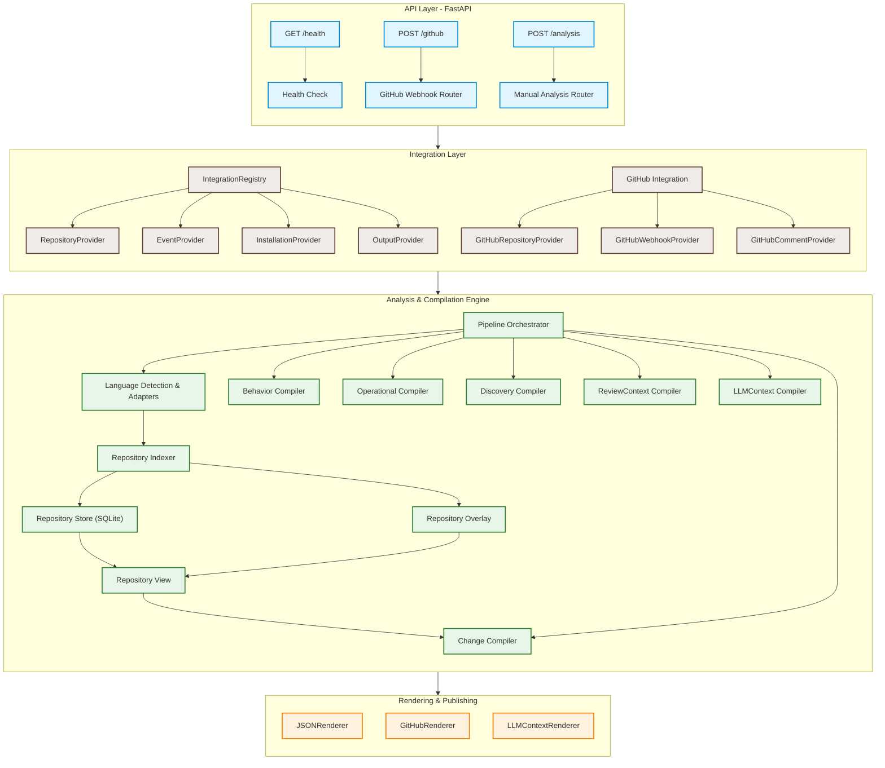
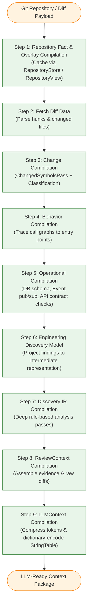

# Factor System & Compiler Architecture

Factor is a high-performance **blast-radius and refactor-risk analysis engine** for code changes. Given a pull request (or a raw git diff), it evaluates downstream impacts on API endpoints, databases, message queues, and event subscriptions. It compiles behavioral and operational change indicators, then packages a token-efficient context for an LLM to produce a final, confidence-weighted review verdict.

---

## 1. System Architecture



---

## 2. The 9-Step Compilation Pipeline

The runtime pipeline is orchestrated by the `Pipeline` class located in [`engine/pipeline/pipeline.py`](file:///Users/jishnupsamal/Jishnu/Factor/cystatic-core/engine/pipeline/pipeline.py). It runs sequentially through the following compiler phases:



### Compiler Phase Details

| Phase | Component | Key Operations & Outputs |
| :--- | :--- | :--- |
| **Step 1** | `RepositoryIndexer`, `RepositoryStore`, `RepositoryOverlay`, `RepositoryView` | Resolves base version facts from `SQLiteRepositoryStore` (or indexes base repository snapshot on-demand using `RepositoryIndexer` and persists to store). Extracts head version files changed in the PR diff, indexes them, and constructs a `RepositoryOverlay`. Wraps the base query and overlay in a `RepositoryView` to present a unified `RepositoryQuery` interface for subsequent phases without materializing a full repository in memory. |
| **Step 2** | `DiffFetcher` | Extracts diff hunks, matching line changes back to files and symbol scopes. |
| **Step 3** | `ChangeCompiler` | Computes semantic deltas using `ChangedSymbolsPass` (detects added, modified, or removed symbols) and `ChangeClassificationPass` (categorizes mutations such as method signature, body, visibility, or decorators). |
| **Step 4** | `BehaviorCompiler` | Traces downstream caller-callee execution chains starting from changed symbols to identify impacted paths and entry points. |
| **Step 5** | `OperationalCompiler` | Enriches findings with domain-specific analysis passes:<br/>- **API Pass:** Detects alterations or breakages in HTTP contracts.<br/>- **Data Pass:** Tracks changes to database schemas, models, or active query structures.<br/>- **Event Pass:** Traces publish/subscribe updates. |
| **Step 6** | `EngineeringDiscoveryCompiler` | Normalizes operational change findings into a structured `EngineeringDiscoveryModel`. |
| **Step 7** | `DiscoveryCompiler` | Executes deep rule-based analysis passes on the `EngineeringDiscoveryModel` to extract deterministic insights (e.g. boundary-crossing transitions, state mutations, shared dependencies, validation gaps) and compiles them into `DiscoveryIR`. |
| **Step 8 & 9** | `LLMContextCompiler` | Bundles findings into a compact `LLMContext` via discovery-centered build orders. Applies token compression, including enum ID encoding, location normalization, duplicate label elimination, and **dead-string elimination** (removing unreferenced string table entries). |

---

## 3. Directory Layout & Module Roles

```
cystatic-core/
├── api/                         # FastAPI Application Layer
│   ├── routes/                  # Routers (/health, /github webhook, manual /analysis)
│   ├── schemas/                 # Pydantic verification and validation schemas
│   ├── deps.py                  # Dependency injection utilities
│   └── main.py                  # API application initialization
│
├── core/                        # Core System & Runtime Utilities
│   ├── config.py                # Environment configurations (pydantic-settings)
│   ├── db.py                    # Database connection pool setup
│   ├── errors.py                # System-wide custom exception definitions
│   ├── logging.py               # Time logging & execution tracing
│   ├── profile.py               # MemoryProfiler (RSS & tracemalloc)
│   └── runtime.py               # Runtime context manager
│
├── engine/                      # Core Analysis & Compilation Engine
│   ├── pipeline/                # Runtime pipeline orchestrator and context
│   │   ├── pipeline.py          # Pipeline manager (executes the 9 compiler phases)
│   │   └── context.py           # Tracks pipeline state, timing, and errors
│   ├── language/                # Source code parsing & Language adapters
│   │   ├── base/                # Abstract compiler framework, normalization, and visitors
│   │   ├── python/              # Python adapter parsing (standard AST extractors)
│   │   ├── java/                # Java adapter parsing (Tree-sitter parser)
│   │   ├── typescript/          # TypeScript adapter parsing
│   │   └── detection.py         # Automatic language detection factory
│   ├── repository/              # Fact-based Repository Architecture
│   │   ├── facts/               # Lightweight semantic entities (Symbol, Call, Endpoint, DB/Event facts, IDs)
│   │   ├── query/               # Abstract RepositoryQuery interface and InMemoryRepository fallback
│   │   ├── store/               # SQLiteRepositoryStore backend for persistent version facts and schema definition
│   │   ├── indexing/            # RepositoryIndexer parsing and indexing facts into sinks (InMemory/PersistentFactSink)
│   │   ├── overlay/             # RepositoryOverlay (PR diff mutations) and RepositoryView (layered query scope)
│   │   └── model/               # Legacy RepositoryGraph & RepositoryModel structures (guarded from construction)
│   ├── change/                  # ChangeCompiler (changed symbols & classification passes)
│   ├── behavior/                # BehaviorCompiler (impacted control flows & call graphs)
│   ├── operational/             # OperationalCompiler (API/DB/Event passes)
│   ├── discovery/               # DiscoveryCompiler (projects to Discovery IR model)
│   ├── review_context/          # ReviewContextCompiler (compiles target review details)
│   └── llm_context/             # LLMContextCompiler (compresses context for the LLM)
│
├── integrations/                # Pluggable Platform Integrations
│   ├── base/                    # Platform-agnostic interfaces (Repository, Event, Output)
│   └── github/                  # GitHub VCS implementations & comment/JSON renderers
│
├── models/                      # SQLAlchemy & system-wide Pydantic data models
├── repositories/                # Database service layer for indexed documents
├── workers/                     # Background workers for processing queued analyses
└── tests/                       # Complete pytest suite
```

---

## 4. Key Architectural Patterns

### Pluggable Provider Pattern
External platforms are abstracted behind interfaces defined in [`integrations/base/`](file:///Users/jishnupsamal/Jishnu/Factor/cystatic-core/integrations/base/). The compiler engine operates entirely on these interfaces (e.g. `RepositoryProvider`), meaning integration with new platforms (like GitLab, Bitbucket, or self-hosted VCS) requires no modifications to the core analysis engine.

### Deterministic & Immutable Models
To prevent side effects across compiler passes, all data structures produced throughout the compilation pipeline are designed as frozen, immutable dataclasses. The pipeline guarantees that given the same input `ReviewContext`, the output `LLMContext` is 100% deterministic and reproducible.

### Isolated Language Parsers
Language-specific features are parsed by language adapters in [`engine/language/`](file:///Users/jishnupsamal/Jishnu/Factor/cystatic-core/engine/language/) and emitted as normalized, language-agnostic repository facts (symbols, calls, references, database entries, events, etc.). Downstream compilers query the repository and overlays via the `RepositoryQuery` and `RepositoryView` interfaces, completely isolating them from syntactic quirks of individual programming languages.

### Fact-Based Repository View Pattern
To scale the engine to repositories with thousands of files and millions of lines of code without incurring massive memory overhead (which previously caused 3.4+ GB memory peaks), the repository is represented as a set of lightweight, queryable facts stored in a persistent `SQLiteRepositoryStore`.
- **Base Version Facts**: Fully indexed facts (symbols, calls, imports, type dependencies, endpoints, database entities, events) are cached in SQLite.
- **PR Overlay**: During analysis, only the files added or modified in the pull request diff are indexed on the fly. Their facts are collected in a `RepositoryOverlay`.
- **Dynamic View**: A `RepositoryView` merges the base database facts with the `RepositoryOverlay` in memory, presenting a unified `RepositoryQuery` interface. This allows downstream compilers to resolve call graphs and operational surfaces dynamically, without ever loading the entire code tree or constructing full in-memory graph objects.
- **Architectural Guard**: In production PR-analysis runs, the runtime sets `PREVENT_LEGACY_ARCHITECTURE` to `True` via a ContextVar. Any attempt to construct legacy in-memory objects (like `RepositoryGraph`, `RepositoryModel`, or `GraphPatcher`) immediately raises a runtime error to prevent memory regressions.

### Graceful Degradation
Analysis and operational passes run independently. If a highly complex database parse or event subscription extraction fails, the pipeline isolates the error and degrades gracefully, allowing standard symbol change and control flow tracing to proceed uninterrupted.

---

## 5. Performance and Resource Monitoring

Factor runs a built-in diagnostics system for tracking system footprint, defined in [`core/profile.py`](file:///Users/jishnupsamal/Jishnu/Factor/cystatic-core/core/profile.py):

> [!NOTE]
> **MemoryProfiler** (`core/profile.py`)
> - Tracks real-time Process RSS usage (using `psutil`) sampled on a background thread every 5ms.
> - Tracks precise heap allocation diagnostics via Python's `tracemalloc` to trace memory usage back to specific files and line numbers.
> - Dumps structured diagnostics (`memory_checkpoints.json`) into the log directory for profiling execution runs and identifying memory growth patterns.
