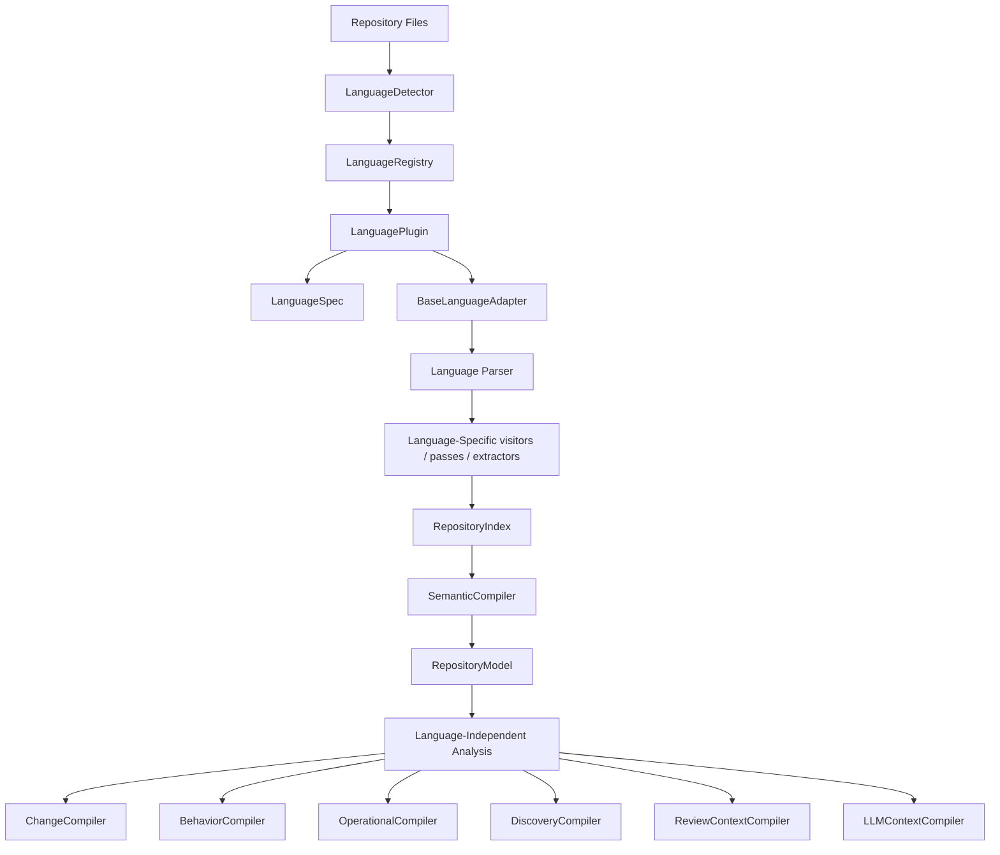
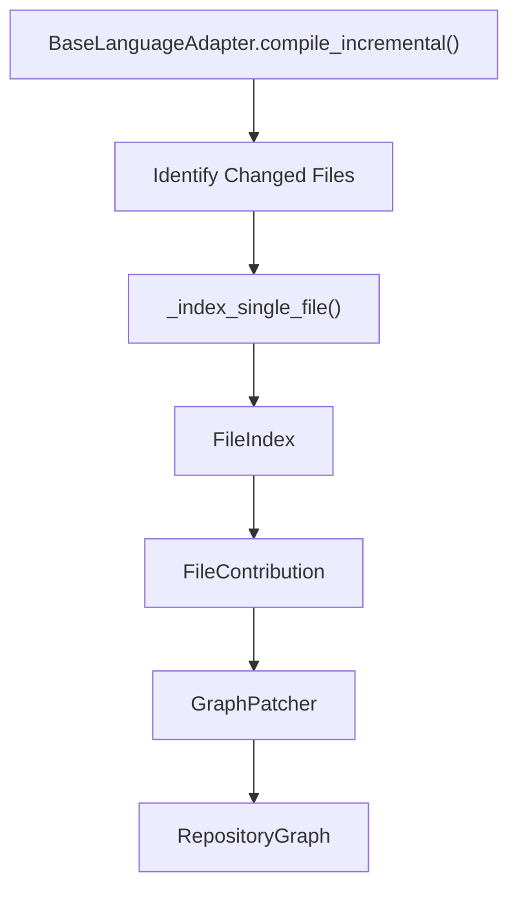

# Language Extension Developer Guide: Adding Support for a Programming Language

This guide explains the Language Extension Architecture of the repository and provides a step-by-step developer guide on exactly how to add support for a new programming language (e.g., Rust, Go, Kotlin) to the static analysis pipeline.

---

## 1. Architecture & Pipeline Flow

The compiler pipeline enforces a strict **one-way architectural boundary** between language-specific frontends and language-independent downstream compilers. 

### Core Analysis Compilation Flow

The following diagram illustrates how raw files are processed, detected, parsed, indexed, and compiled into resolved semantic models:



### Incremental Compilation Flow

When pull requests or commits modify files in a repository, the pipeline uses **incremental compilation** to patch the graph rather than re-compiling the entire repository from scratch:



---

## 2. Directory Structure

Language-specific frontends reside in the [`engine/language/`](file:///Users/jishnupsamal/Jishnu/Factor/cystatic-core/engine/language/) directory.

### Directory Layout

```text
engine/language/
├── __init__.py           # Package initialization
├── base/                 # Base classes and interfaces defining contracts
│   ├── __init__.py
│   ├── adapter.py        # BaseLanguageAdapter abstract class
│   ├── capabilities.py   # LanguageCapabilities dataclass
│   ├── file_context.py   # FileContext container class
│   ├── index_compiler.py # IndexCompiler orchestration
│   ├── parser.py         # BaseParser interface
│   ├── passes/           # BaseIndexPass class
│   ├── plugin.py         # LanguagePlugin protocol
│   ├── spec.py           # LanguageSpec dataclass
│   └── visitors/         # BaseVisitor class
├── detection.py          # LanguageDetector & LanguageAdapterFactory
├── registry.py           # LanguageRegistry management
├── builtins.py           # Registration of built-in plugins
├── python/               # Reference Python frontend implementation
├── java/                 # Reference Java frontend implementation (regex-based)
└── typescript/           # Reference TypeScript frontend implementation (tree-sitter-based)
```

### Subdirectory Roles

Each concrete language frontend (like `python/` or `typescript/`) is divided into several subdirectories:
* **`parser/`**: Houses the syntax parser wrapping language-specific AST engines (e.g., standard `ast` module or `tree-sitter`).
* **`visitors/`**: Handles the AST traversal. If the language uses a single-pass visitor, it walks the AST once and dispatches to indexing passes.
* **`extractors/`**: Legacy structural extractor helper modules (maintained for structural parity).
* **`passes/`**: Contains the individual indexing passes that emit facts from the syntax tree (e.g., symbols, imports, call expressions, type inheritance).

---

## 3. The Plugin System

The plugin layer handles registration, discovery, metadata, and capabilities. A language plugin is intentionally thin.

### LanguagePlugin Protocol

Defined in [`engine/language/base/plugin.py`](file:///Users/jishnupsamal/Jishnu/Factor/cystatic-core/engine/language/base/plugin.py):

```python
class LanguagePlugin(Protocol):
    spec: LanguageSpec

    def create_adapter(self) -> BaseLanguageAdapter:
        """Create a new instance of the language adapter."""
        ...
```

* **Plugin Responsibilities**: Expose the [`LanguageSpec`](file:///Users/jishnupsamal/Jishnu/Factor/cystatic-core/engine/language/base/spec.py) (metadata and capability declarations) and act as a factory for instantiating the language adapter.
* **Plugin Constraints**: Plugins must **never** parse source files, execute passes, build indexes, or perform compilation. They are strictly metadata descriptors and factory boundaries.

### LanguageSpec

Defined in [`engine/language/base/spec.py`](file:///Users/jishnupsamal/Jishnu/Factor/cystatic-core/engine/language/base/spec.py):

```python
@dataclass(frozen=True, slots=True)
class LanguageSpec:
    id: str
    extensions: frozenset[str]
    filenames: frozenset[str] = field(default_factory=frozenset)
    capabilities: LanguageCapabilities = field(default_factory=LanguageCapabilities)
```

* `id`: Stable string identifier (e.g. `"python"`, `"typescript"`).
* `extensions`: Frozenset of matching file extensions (e.g., `frozenset({".ts", ".tsx", ".mts", ".cts"})`).
* `filenames`: Frozenset of special filenames (e.g., `frozenset({"Dockerfile"})`).

### Capabilities & Graceful Degradation

Defined in [`engine/language/base/capabilities.py`](file:///Users/jishnupsamal/Jishnu/Factor/cystatic-core/engine/language/base/capabilities.py):

```python
@dataclass(frozen=True, slots=True)
class LanguageCapabilities:
    symbols: bool = True
    imports: bool = True
    calls: bool = True
    types: bool = False
    entrypoints: bool = False
    events: bool = False
    persistence: bool = False
    tests: bool = False
```

#### Unsupported Capability vs. Supported with Zero Findings
* **Unsupported (`capability=False`)**: The language frontend does not implement the extraction pass for this domain (e.g., `persistence=False` for TypeScript). Downstream compilation passes will skip this phase entirely, ensuring the system degrades gracefully without raising errors.
* **Supported with Zero Findings (`capability=True`)**: The frontend implements the extraction pass, but running it on the repository returned zero facts (e.g., a codebase with no class declarations). This is a normal compiled state.

> [!IMPORTANT]
> Downstream code must check capability flags instead of hardcoding language name checks:
> ```python
> # CORRECT
> if spec.capabilities.types:
>     compile_type_hierarchies()
> 
> # INCORRECT
> if language == "python" or language == "typescript":
>     compile_type_hierarchies()
> ```

### Minimal Plugin Example

```python
from engine.language.base.adapter import BaseLanguageAdapter
from engine.language.base.capabilities import LanguageCapabilities
from engine.language.base.spec import LanguageSpec
from .adapter import NewLanguageLanguageAdapter


class NewLanguagePlugin:
    """Concrete plugin implementation for NewLanguage."""

    spec = LanguageSpec(
        id="newlanguage",
        extensions=frozenset({".nl"}),
        capabilities=LanguageCapabilities(
            symbols=True,
            imports=True,
            calls=True,
            types=True,
            entrypoints=False,
            events=False,
            persistence=False,
            tests=False,
        ),
    )

    def create_adapter(self) -> BaseLanguageAdapter:
        """Create a NewLanguageLanguageAdapter instance."""
        return NewLanguageLanguageAdapter()
```

---

## 4. Adapter Implementation

The adapter is the orchestrator of the language-specific compiler passes. All concrete adapters must subclass [`BaseLanguageAdapter`](file:///Users/jishnupsamal/Jishnu/Factor/cystatic-core/engine/language/base/adapter.py) and replicate the reference implementation architecture found in Python's [`adapter.py`](file:///Users/jishnupsamal/Jishnu/Factor/cystatic-core/engine/language/python/adapter.py).

### Core Adapter API

A concrete adapter must implement the following methods and properties:

```python
class BaseLanguageAdapter(ABC):
    @abstractmethod
    def get_language(self) -> str:
        """Return the stable language string (e.g. 'python', 'typescript')."""
        ...

    @abstractmethod
    def get_compiler_passes(self) -> list[str]:
        """Return pass names in execution order for backward compatibility."""
        ...

    @abstractmethod
    def compile(self, repository_input: dict[str, Any]) -> RepositoryModel:
        """Compile a repository snapshot into a RepositoryModel.
        
        Args:
            repository_input: Snapshot dict containing 'files' mapping paths to content.
        """
        ...

    @abstractmethod
    def build_index(self, repository_input: dict[str, Any]) -> RepositoryIndex:
        """Build the RepositoryIndex containing structural facts only."""
        ...

    @abstractmethod
    def _build_index(self, files: dict[str, str], language: str) -> RepositoryIndex:
        """Internal worker to parse files and compile the RepositoryIndex."""
        ...

    @abstractmethod
    def _index_single_file(self, file_path: str, content: str, language: str) -> FileIndex:
        """Parse and run indexing passes on a single source file (for incremental compiles)."""
        ...
```

---

## 5. Parser Implementation

Parsers must implement the [`BaseParser`](file:///Users/jishnupsamal/Jishnu/Factor/cystatic-core/engine/language/base/parser.py) interface.

### Parser Interface

```python
class BaseParser(ABC):
    @abstractmethod
    def parse(self, content: str, file_path: str) -> Any:
        """Parse source content into a language-native syntax tree (e.g., Tree-sitter Tree)."""
        ...

    @abstractmethod
    def supports_file(self, file_path: str) -> bool:
        """Check if this parser supports the given file path."""
        ...
```

### Encapsulation Rules

> [!WARNING]
> Language-specific AST and parser nodes (such as Python `ast.AST` or Tree-sitter `Node`) **must remain fully encapsulated** within the language adapter module. They must never escape into [`RepositoryIndex`](file:///Users/jishnupsamal/Jishnu/Factor/cystatic-core/engine/repository/model/repository_index.py), [`RepositoryModel`](file:///Users/jishnupsamal/Jishnu/Factor/cystatic-core/engine/repository/model/repository_model.py), or downstream compilers.

```text
TypeScript Node (Tree-sitter)
         ↓
TypeScript Adapter / Passes (Extracts properties)
         ↓
  SymbolEntry (Normalized string/ints)
         ↓
  RepositoryIndex (Language-independent Boundary)
```

---

## 6. Indexing Passes & Extractors

Indexing passes translate the syntax tree into language-independent structural facts. 

### Mandatory vs. Stubbed Passes

To maintain structural parity with Python, every new language frontend should include all 9 indexing passes:
1. **`symbols`**: Class, function, method definitions (Mandatory if `symbols=True`).
2. **`imports`**: Imports of module namespaces and aliases (Mandatory if `imports=True`).
3. **`calls`**: Direct call expressions (Mandatory if `calls=True`).
4. **`types`**: Class inheritance relations (Mandatory if `types=True`).
5. **`entrypoints`**: HTTP API endpoints (Supported/Stubbed).
6. **`persistence`**: Database schemas / ORMs (Supported/Stubbed).
7. **`events`**: Event emitters/listeners (Supported/Stubbed).
8. **`tests`**: Test suite definitions (Supported/Stubbed).
9. **`configuration`**: Project configurations (Supported/Stubbed).

If a capability is set to `False` in the plugin configuration, the corresponding pass must be implemented as a simple no-op stub:

```python
class TypeScriptPersistenceIndexPass(BaseIndexPass):
    """Stub pass for TypeScript persistence as it is unsupported."""

    def process(self, context: FileContext, builder: dict[str, Any]) -> None:
        pass
```

### Fact Normalization

Indexing passes must output standardized, language-agnostic entries defined in [`engine/repository/model/repository_index.py`](file:///Users/jishnupsamal/Jishnu/Factor/cystatic-core/engine/repository/model/repository_index.py):
* `SymbolEntry`: Kind (`"class"`, `"function"`, `"method"`), line bounds, visibility.
* `ImportEntry`: Module path, names imported, import type (`"import"` or `"from_import"`).
* `CallEntry`: Callee name, receiver name, caller method name, line number.
* `TypeRelationshipEntry`: Source class, target base class, relation type (`"extends"`).

---

## 7. RepositoryIndex: The Handoff Boundary

A clear division of labor exists between the frontend (language adapter) and backend (semantic compiler):

| Responsibility | Component | Layer |
| :--- | :--- | :--- |
| **Parsing** | `BaseParser` subclass | Frontend (Language-specific) |
| **AST Traversal** | `BaseVisitor` subclass | Frontend (Language-specific) |
| **Syntax Extraction** | `BaseIndexPass` subclasses | Frontend (Language-specific) |
| **Normalization** | Creating `RepositoryIndex` | Frontend (Language-specific) |
| **Semantic Resolution** | Reference matching, Call Graph matching | Backend (Language-independent) |
| **Graph Construction** | Building `RepositoryGraph` / `RepositoryModel` | Backend (Language-independent) |
| **Incremental Patching** | `GraphPatcher` execution | Backend (Language-independent) |
| **Downstream Analyses** | Change/Behavior/Operational Compilers | Backend (Language-independent) |

---

## 8. Incremental Compilation Integration

To support in-place patching of pull requests:
* Concrete adapters **must not** implement custom graph-patching or file-diff logic.
* Adapters must inherit the base implementation of `compile_incremental` defined in [`BaseLanguageAdapter`](file:///Users/jishnupsamal/Jishnu/Factor/cystatic-core/engine/language/base/adapter.py#L123-L275).
* Developers must implement a correct `_index_single_file(file_path, content, language)` method. When invoked with a changed file, this method must parse it, run visitor passes, and return a single [`FileIndex`](file:///Users/jishnupsamal/Jishnu/Factor/cystatic-core/engine/repository/model/repository_index.py) containing only the facts for that file.

---

## 9. Detection & Registration

### 1. Spec Specification
Set the ID and register extensions in `LanguageSpec` (e.g., `extensions=frozenset({".ts", ".tsx"})`).

### 2. Builtins Registry
Add your plugin to the default registry inside [`engine/language/builtins.py`](file:///Users/jishnupsamal/Jishnu/Factor/cystatic-core/engine/language/builtins.py):

```python
def create_default_language_registry() -> LanguageRegistry:
    registry = LanguageRegistry()
    registry.register(PythonPlugin())
    registry.register(TypeScriptPlugin())  # Registered here
    registry.register(JavaPlugin())
    return registry
```

### 3. Detector Voting Algorithm
The [`LanguageDetector`](file:///Users/jishnupsamal/Jishnu/Factor/cystatic-core/engine/language/detection.py) runs dynamically on repository file trees:
* It looks up extensions matching registered plugins in `LanguageRegistry`.
* It accumulates votes for each language based on file extension matching.
* The plugin with the highest vote count is selected as the primary repository language.

> [!WARNING]
> Do not add language-specific hardcoded branching in the detector:
> ```python
> # FORBIDDEN
> if file_path.endswith(".ts"):
>     return TypeScriptLanguageAdapter()
> ```

---

## 10. Test Layers

Every language frontend must be validated using the following test layers (refer to [`tests/test_typescript_adapter.py`](file:///Users/jishnupsamal/Jishnu/Factor/cystatic-core/tests/test_typescript_adapter.py) for concrete examples):

1. **Plugin Tests**: Verify capabilities and extensions spec (e.g., `test_plugin_capabilities`).
2. **Adapter Contract Tests**: Verify methods exist and adapter initializes correctly.
3. **Symbol Collection Tests**: Verify function, class, and method symbol generation.
4. **Import Collection Tests**: Verify named, namespace, and default imports extraction.
5. **Call Collection Tests**: Verify function and method calls and receiver extraction.
6. **Type Relationship Tests**: Verify class inheritance (`extends` mapping).
7. **Full Compilation Tests**: Verify adapter's `compile()` method creates a semantic `RepositoryModel`.
8. **Incremental Compilation Tests**: Verify that changed files patch the graph successfully.
9. **Pipeline Integration Tests**: Run the full pipeline overlay using `Pipeline.run(request)`.

---

## 11. Anti-Patterns to Avoid

* ❌ **Fat Plugins**: Writing parsing or symbol-extracting logic in the plugin instead of the adapter.
* ❌ **Direct Adapter Imports**: Directly importing and constructing adapters outside the registry (e.g., `from engine.language.python.adapter import PythonLanguageAdapter`). Use `registry.create_adapter(language)` instead.
* ❌ **Downstream Branches**: Adding `if language == "newlanguage"` checks in operational, change, or review context compilers.
* ❌ **AST Leaks**: Returning raw Tree-sitter `Node` or AST structures in the `RepositoryIndex` or `RepositoryModel`.
* ❌ **Semantic Duplication**: Writing call-graph matching or reference resolution inside your adapter passes. Let `SemanticCompiler` handle this.
* ❌ **Patcher Duplication**: Overriding `compile_incremental` or writing a custom graph patcher.

---

## 12. Implementation Checklist

Use this checklist to verify your language frontend implementation:

- [ ] Inspect the reference Python implementation ([`engine/language/python/`](file:///Users/jishnupsamal/Jishnu/Factor/cystatic-core/engine/language/python/)).
- [ ] Create package directory: `engine/language/<language>/`.
- [ ] Implement the syntax parser in `<language>/parser/` implementing [`BaseParser`](file:///Users/jishnupsamal/Jishnu/Factor/cystatic-core/engine/language/base/parser.py).
- [ ] Implement composite visitor in `<language>/visitors/` implementing [`BaseVisitor`](file:///Users/jishnupsamal/Jishnu/Factor/cystatic-core/engine/language/base/visitors/__init__.py) if traversing tree-sitter or AST structures.
- [ ] Create the 9 indexing passes in `<language>/passes/` subclassing [`BaseIndexPass`](file:///Users/jishnupsamal/Jishnu/Factor/cystatic-core/engine/language/base/passes/__init__.py). Stub any unsupported capabilities.
- [ ] Create the 9 extractor skeleton directories under `<language>/extractors/` for structure parity.
- [ ] Implement the adapter in `<language>/adapter.py` subclassing [`BaseLanguageAdapter`](file:///Users/jishnupsamal/Jishnu/Factor/cystatic-core/engine/language/base/adapter.py) with the standard core methods:
    * `get_language()`
    * `get_compiler_passes()`
    * `compile()`
    * `build_index()`
    * `_build_index()`
    * `_index_single_file()`
- [ ] Implement the plugin in `<language>/plugin.py` configuring spec, extensions, and capabilities.
- [ ] Register the plugin in [`engine/language/builtins.py`](file:///Users/jishnupsamal/Jishnu/Factor/cystatic-core/engine/language/builtins.py).
- [ ] Add unit and integration tests in `tests/`.
- [ ] Verify using `pytest`.
