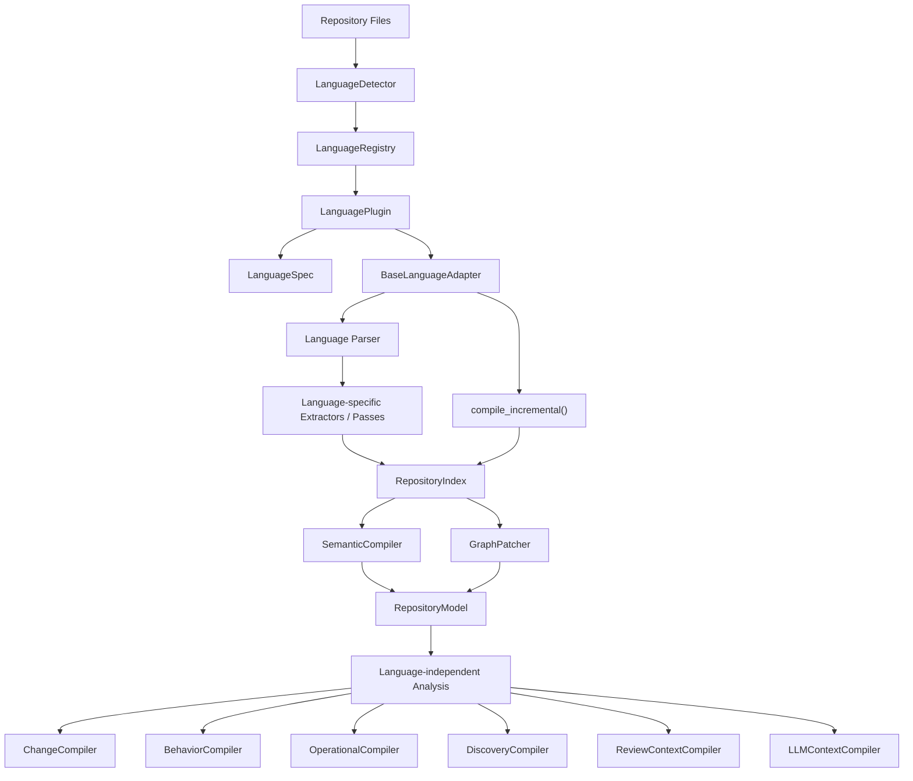

# Adding Support for a Programming Language

This developer guide describes the Language Extension Architecture of the repository and explains how to add support for a new programming language.

---

## Quick Start: Add a Language

To quickly add support for a new language, follow this high-level workflow:

1. **Create the Package**: Create `engine/language/<language>/`.
2. **Define the Plugin**: Implement the `LanguagePlugin` protocol in `<language>/plugin.py`.
3. **Specify Metadata**: Declare `LanguageSpec` with the stable language ID, file extensions, and special filenames.
4. **Declare Capabilities**: Configure `LanguageCapabilities` (e.g. `symbols=True`, `persistence=False`) depending on what analysis passes are available.
5. **Implement the Adapter**: Subclass `BaseLanguageAdapter` in `<language>/adapter.py`.
6. **Integrate the Parser**: Implement or call a parser satisfying the `BaseParser` interface.
7. **Write Indexing Passes**: Implement `BaseIndexPass` subclasses to extract structural facts.
8. **Construct the Index**: Run passes via `IndexCompiler` to produce a `FileIndex` and aggregate into a `RepositoryIndex`.
9. **Implement Single-File Indexing**: Define `_index_single_file` on your adapter to support incremental parsing.
10. **Register the Plugin**: Register the plugin instance inside `engine/language/builtins.py`.
11. **Write Tests**: Add detection, plugin protocol, adapter contract, full compilation, and incremental patching tests in the `tests/` directory.
12. **Validate**: Run the full test suite to verify the new language compiles and degrades gracefully.

---

## 1. Architectural Diagram & Boundary

The compiler pipeline enforces a strict **one-way architectural boundary** between language-specific frontends and language-independent downstream compilers. 

### Pipeline Flow



### The Language Boundary

```text
Language-Specific (Frontend)
══════════════════════════════════════════════════════════════════
  Parser (AST / Line representation)
  Extractors / Visitors / Passes
  Adapter
══════════════════════════════════════════════════════════════════
  RepositoryIndex (Structural Facts)
══════════════════════════════════════════════════════════════════
Language-Independent (Backend)
══════════════════════════════════════════════════════════════════
  SemanticCompiler
  RepositoryModel
  GraphPatcher
  Analysis Compilers (Change, Behavior, Operational, etc.)
```

> [!IMPORTANT]
> **Boundary Rule**: Language-specific AST classes (such as Python's `ast.AST` or a Tree-sitter `Node`) must **never** escape the language adapter boundary. They must not appear inside the `RepositoryIndex`, `RepositoryModel`, or any downstream compiler.

* **Allowed**: `Python AST` $\rightarrow$ `Python Adapter` $\rightarrow$ `RepositoryIndex`.
* **Forbidden**: `ChangeCompiler` directly inspecting a `Python AST` node, or `BehaviorCompiler` checking a Tree-sitter node type.

---

## 2. The Plugin Layer

The plugin layer handles registration, discovery, metadata, and capabilities. A language plugin is intentionally thin.

### LanguagePlugin Protocol

Defined in [`engine/language/base/plugin.py`](file:///Users/jishnupsamal/Jishnu/Factor/cystatic-core/engine/language/base/plugin.py):

```python
class LanguagePlugin(Protocol):
    spec: LanguageSpec

    def create_adapter(self) -> BaseLanguageAdapter:
        """Create a new instance of the language adapter."""
        ...
```

**Responsibilities**:
* Identify the language using `LanguageSpec`.
* Define capability flags via `LanguageCapabilities`.
* Instantiate the adapter via `create_adapter()`.

**Restrictions**:
* Must **not** parse files, extract symbols, compile, or implement incremental logic.

### LanguageSpec

Defined in [`engine/language/base/spec.py`](file:///Users/jishnupsamal/Jishnu/Factor/cystatic-core/engine/language/base/spec.py):

```python
@dataclass(frozen=True, slots=True)
class LanguageSpec:
    id: str
    extensions: frozenset[str]
    filenames: frozenset[str] = field(default_factory=frozenset)
    capabilities: LanguageCapabilities = field(default_factory=LanguageCapabilities)
```

* `id`: The unique, stable string identifier of the language (e.g. `"python"`, `"java"`).
* `extensions`: Frozenset of file extensions matching this language (e.g. `frozenset({".py"})`).
* `filenames`: Frozenset of special filenames used for detection (e.g. `frozenset({"Dockerfile"})`).
* `capabilities`: Declares which features are supported by the frontend.

### LanguageCapabilities & Graceful Degradation

Defined in [`engine/language/base/capabilities.py`](file:///Users/jishnupsamal/Jishnu/Factor/cystatic-core/engine/language/base/capabilities.py):

```python
@dataclass(frozen=True, slots=True)
class LanguageCapabilities:
    symbols: bool = True
    imports: bool = True
    calls: bool = True
    types: bool = False
    entrypoints: bool = False
    events: bool = False
    persistence: bool = False
    tests: bool = False
```

#### Supported vs Unsupported Analysis

The capability model enforces a distinction between:
* **Unsupported (`capability=False`)**: The language adapter does not implement analysis for this domain. Downstream pipeline stages skip this analysis pass entirely, preventing compilation crashes and ensuring graceful degradation.
* **Supported but no findings (`capability=True`)**: The analysis is supported, but running it returned zero facts. This indicates a valid compilation state where the repository simply does not contain these elements.

Downstream logic queries these flags rather than checking the language name:

```python
# GOOD: Capability check
if spec.capabilities.persistence:
    run_persistence_analysis()

# BAD: Language check
if language == "python":
    run_persistence_analysis()
```

---

## 3. The Adapter Layer

The adapter is the main worker of the language frontend.

### BaseLanguageAdapter

Defined in [`engine/language/base/adapter.py`](file:///Users/jishnupsamal/Jishnu/Factor/cystatic-core/engine/language/base/adapter.py), it exposes the following core contract:

```python
class BaseLanguageAdapter(ABC):
    @abstractmethod
    def get_language(self) -> str:
        """Return the stable language identifier."""
        ...

    @abstractmethod
    def compile(self, repository_input: dict[str, Any]) -> RepositoryModel:
        """Compile a repository snapshot into a RepositoryModel."""
        ...

    @abstractmethod
    def get_compiler_passes(self) -> list[str]:
        """Return names of compiler passes in execution order."""
        ...

    @abstractmethod
    def _index_single_file(self, file_path: str, content: str, language: str) -> Any:
        """Parse and run indexing passes on a single source file."""
        ...

    def compile_graph(self, repository_input: dict[str, Any]) -> RepositoryGraph:
        """Compile a repository into a patchable RepositoryGraph."""
        ...

    def compile_incremental(self, base_graph: RepositoryGraph, repository_input: dict[str, Any]) -> RepositoryGraph:
        """Compile changed files and patch the base RepositoryGraph."""
        ...
```

### Relationship Flow

```text
Plugin (creates) ──> Adapter ──> Parser (syntax) ──> Extractors/Passes (facts)
```

---

## 4. Parser Choices and Extraction Architecture

The parser selection and traversal strategy is a localized frontend implementation detail.

### Parser Abstraction

All parsers subclass `BaseParser` (defined in [`engine/language/base/parser.py`](file:///Users/jishnupsamal/Jishnu/Factor/cystatic-core/engine/language/base/parser.py)), implementing:
* `parse(content, file_path) -> Any`: Converts source to parsed output.
* `supports_file(file_path) -> bool`: Checks extension compatibility.

### Traverse & Extract Strategies

The indexing step takes a parsed tree and passes it through one or more indexing passes implementing `BaseIndexPass` (defined in [`engine/language/base/passes/__init__.py`](file:///Users/jishnupsamal/Jishnu/Factor/cystatic-core/engine/language/base/passes/__init__.py)):

#### Strategy A: Composite Visitor (AST-Based)
For languages with complex AST structures (like Python), traversing the tree multiple times is costly. Instead, a single traversal is made using a composite visitor (`BaseVisitor` subclass) that dispatches node events to all registered passes simultaneously.
* **Orchestration**: `IndexCompiler.compile_with_visitor(file_contexts, language, visitor)`

#### Strategy B: Sequential Runs (Line/Regex-Based)
For lightweight frontends or those without a structured AST, passes can run sequentially, each inspecting the parsed structure.
* **Orchestration**: `IndexCompiler.compile(file_contexts, language)`

---

## 5. RepositoryIndex: The Handoff Boundary

The indexing passes collect raw facts into a mutable dictionary which is compiled into a `RepositoryIndex` containing:

* **`SymbolEntry`**: Declarations of classes, methods, functions, variables.
* **`ImportEntry`**: Import statements containing imported namespaces, module names, and line numbers.
* **`RawReference`**: Unresolved references (e.g. variable reads, function calls).
* **`EntrypointEntry`**: Discovered app entrypoints.
* **`TypeRelationshipEntry`**: Class inheritance and subtyping relationships.
* **`PersistenceModelEntry`**, `EventEntry`, `TestEntry`, etc.

Every extracted entry must be a standard, language-agnostic dataclass defined in [`engine/repository/model/repository_index.py`](file:///Users/jishnupsamal/Jishnu/Factor/cystatic-core/engine/repository/model/repository_index.py).

---

## 6. Semantic and Incremental Compilation

### Semantic Compilation

Once the adapter creates the `RepositoryIndex`, it invokes `SemanticCompiler.compile(index, language)`:

```text
RepositoryIndex ──> SemanticCompiler ──> RepositoryModel
```

The language adapter **must not** implement reference resolution or call graph building. The `SemanticCompiler` resolves references, builds call/reference graphs, maps visibilities, and assigns canonical symbol IDs (e.g., `python://path/to/file.py::func_name`).

### Incremental Compilation

Incremental compilation is handled transparently by the base class method `BaseLanguageAdapter.compile_incremental()`. 

To support incremental compilation:
1. The adapter determines which files are added, modified, or deleted.
2. For each added/modified file, the adapter invokes its internal `_index_single_file(path, content, language)` to produce a standalone `FileIndex`.
3. The adapter translates `FileIndex` into a `FileContribution`.
4. The adapter invokes the language-agnostic `GraphPatcher` (`engine.language.base.graph_patcher.GraphPatcher`) to patch the `RepositoryGraph` in-place.

```text
compile_incremental()
  ↓
Identify changed files
  ↓
_index_single_file()
  ↓
FileIndex ──> FileContribution
  ↓
GraphPatcher ──> RepositoryGraph (Patched)
```

> [!WARNING]
> A new language plugin must **not** override `compile_incremental` or implement its own graph patcher.

---

## 7. Registration and Detection

### Registry Configuration

Plugins must be registered in the default language registry function inside [`engine/language/builtins.py`](file:///Users/jishnupsamal/Jishnu/Factor/cystatic-core/engine/language/builtins.py):

```python
def create_default_language_registry() -> LanguageRegistry:
    registry = LanguageRegistry()
    registry.register(PythonPlugin())
    registry.register(TypeScriptPlugin())
    registry.register(JavaPlugin())
    return registry
```

### Detection Flow

When compile requests arrive, `LanguageDetector` determines the language by inspecting the files:

```text
Files ──> LanguageDetector ──> LanguageRegistry ──> Plugin ──> Adapter
```

The detector runs a voting algorithm on input files using metadata from `LanguageSpec`:
1. Checks for matching `LanguageSpec.id` attribute.
2. Checks for matching `LanguageSpec.filenames` (e.g., `Dockerfile`).
3. Checks for matching `LanguageSpec.extensions` (e.g., `.py`, `.java`).
4. Selects the language spec with the highest vote count (resolving ties using registration order).

---

## 8. Built-in Language Matrix

| Language | Parser | Adapter | Plugin | Capabilities | Incremental | Support Status |
| :--- | :--- | :--- | :--- | :--- | :--- | :--- |
| **Python** | Built-in `ast` module | `PythonLanguageAdapter` | `PythonPlugin` | All `True` | Supported (delegates to `_index_single_file`) | Fully Supported |
| **Java** | `JavaParser` (Regex line-splitter) | `JavaLanguageAdapter` | `JavaPlugin` | All `True` | Supported (delegates to `_index_single_file`) | Fully Supported |
| **TypeScript** | None (Stub parser) | `TypeScriptLanguageAdapter` | `TypeScriptPlugin` | All `False` | Unsupported (Raises `LanguageNotSupported`) | Incomplete / Stub |

---

## 9. New Language Skeleton Templates

Developers can copy and rename these skeletons to bootstrap a new language extension.

### 1. Plugin Template (`engine/language/<language>/plugin.py`)

```python
from engine.language.base.adapter import BaseLanguageAdapter
from engine.language.base.capabilities import LanguageCapabilities
from engine.language.base.spec import LanguageSpec
from .adapter import NewLanguageAdapter


class NewLanguagePlugin:
    """Plugin definition for the NewLanguage extension."""

    spec = LanguageSpec(
        id="newlanguage",
        extensions=frozenset({".nl"}),
        filenames=frozenset({"NLConfig"}),
        capabilities=LanguageCapabilities(
            symbols=True,
            imports=True,
            calls=True,
            types=False,
            entrypoints=False,
            events=False,
            persistence=False,
            tests=False,
        ),
    )

    def create_adapter(self) -> BaseLanguageAdapter:
        """Create a NewLanguageAdapter instance."""
        return NewLanguageAdapter()
```

### 2. Adapter Template (`engine/language/<language>/adapter.py`)

```python
from typing import Any
from engine.language.base import BaseLanguageAdapter
from engine.language.base.file_context import FileContext
from engine.language.base.index_compiler import IndexCompiler
from engine.language.base.semantic_compiler import SemanticCompiler
from engine.repository.model import RepositoryModel
from engine.repository.model.repository_index import FileIndex, RepositoryIndex


class NewLanguageAdapter(BaseLanguageAdapter):
    """Language adapter for NewLanguage repositories."""

    def __init__(self) -> None:
        # Define the custom indexing passes
        self._passes = [
            # E.g. NewLanguageSymbolPass(), NewLanguageImportPass()
        ]
        self._index_compiler = IndexCompiler(self._passes)
        self._semantic_compiler = SemanticCompiler()

    def get_language(self) -> str:
        return "newlanguage"

    def get_compiler_passes(self) -> list[str]:
        return ["symbol_collection", "reference_resolution", "call_graph"]

    def compile(self, repository_input: dict[str, Any]) -> RepositoryModel:
        files = repository_input.get("files", {})
        language = repository_input.get("language", self.get_language())
        index = self._build_index(files, language)
        return self._semantic_compiler.compile(index, language)

    def build_index(self, repository_input: dict[str, Any]) -> RepositoryIndex:
        files = repository_input.get("files", {})
        language = repository_input.get("language", self.get_language())
        return self._build_index(files, language)

    def _build_index(self, files: dict[str, str], language: str) -> RepositoryIndex:
        target_files = [f for f in files if f.endswith(".nl")]

        def generate_contexts():
            for file_path in target_files:
                content = files.get(file_path, "")
                # Parse content here (e.g. AST or lines)
                parsed_tree = content.split("\n") 
                yield FileContext(
                    path=file_path,
                    source=content,
                    ast=parsed_tree,
                    language=language,
                )

        return self._index_compiler.compile(generate_contexts(), language)

    def _index_single_file(self, file_path: str, content: str, language: str) -> FileIndex:
        """Parse and run indexing passes on a single source file to support incremental compilation."""
        if not file_path.endswith(".nl"):
            return FileIndex(path=file_path, language=language)

        parsed_tree = content.split("\n")
        context = FileContext(
            path=file_path,
            source=content,
            ast=parsed_tree,
            language=language,
        )
        repo_index = self._index_compiler.compile([context], language)
        return repo_index.files[0]
```

---

## 10. Architectural Anti-Patterns ("Do Not Do This")

To avoid coupling and architectural regressions:

### 1. Do Not Add Language Branches Downstream
Downstream components must remain language-independent.
* **Incorrect**:
  ```python
  if language == "python":
      # process python classes
  elif language == "java":
      # process java classes
  ```
* **Correct**: Extract normalized type declarations in the adapter, populate `TypeRelationshipEntry` in the index, and let the downstream code inspect the index.

### 2. Do Not Expose Parser Types in the Index or Model
Keep parser nodes fully encapsulated inside the frontend package.
* **Incorrect**:
  ```python
  @dataclass
  class SymbolEntry:
      node: ast.AST  # leaks Python AST
  ```
* **Correct**: Extract only native Python/JSON-serializable data types (strings, integers, dicts).

### 3. Do Not Make Plugins Fat
A plugin is a metadata descriptor and factory, not a compiler.
* **Incorrect**:
  ```python
  class PythonPlugin:
      def parse(self, content): ...
      def compile(self, repo): ...
  ```
* **Correct**: Delegate all parsing, indexing, and compiling responsibility to the adapter.

### 4. Do Not Bypass the Registry
Do not import and instantiate concrete adapters from core or pipeline code.
* **Incorrect**:
  ```python
  from engine.language.python.adapter import PythonLanguageAdapter
  adapter = PythonLanguageAdapter()
  ```
* **Correct**:
  ```python
  plugin = registry.get("python")
  adapter = plugin.create_adapter()
  ```

### 5. Do Not Duplicate Incremental Compilation Logic
Do not write custom file-diffing or in-place patching logic within the concrete adapter.
* **Incorrect**: Overriding `compile_incremental` to implement custom patchers.
* **Correct**: Inherit the base implementation of `compile_incremental` and implement the file-scoped `_index_single_file` function.

---

## 11. Current Architectural Gaps

An analysis of the current `engine/language` implementation reveals the following architectural gaps:

1. **Concrete Adapter Exports in Package `__init__.py`**:
   The package [`engine/language/__init__.py`](file:///Users/jishnupsamal/Jishnu/Factor/cystatic-core/engine/language/__init__.py) imports and exposes `PythonLanguageAdapter` and `JavaLanguageAdapter` directly. This compromises registry-based isolation and could encourage developers to import concrete classes instead of querying them via the registry.
2. **Java Parser Implementation**:
   The `JavaParser` is currently a placeholder regex-based line splitter that splits source code by lines (`content.split("\n")`) instead of building a structured abstract syntax tree or using Tree-sitter. This limits the precision of the Java indexing passes.
3. **TypeScript Implementation**:
   TypeScript is currently a stub adapter. `TypeScriptLanguageAdapter` raises `LanguageNotSupported` on all compiling/indexing actions, and all its capability flags are hardcoded to `False`. Proper TypeScript support has not yet been implemented.
4. **Duplicate Compile/Build Index API**:
   Some adapters define both `compile()` and `build_index()` as public APIs, while `BaseLanguageAdapter` defines `compile()` but leaves `_build_index` private. Resolving this discrepancy and standardizing the build index API would clean up adapter boundaries.
