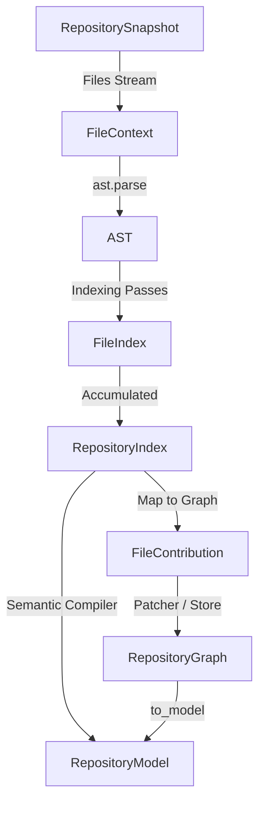

# Repository Representation Lifecycle Audit

This document maps the lifecycles, consumers, lifetimes, redundancies, and optimization opportunities for the eight key representations of code repositories in `cystatic-core`.

---

## 1. Overview: Lifecycle Flow

---

## 2. Representation Breakdown

### RepositorySnapshot

*   **Why does it exist?**
    It represents the downloaded repository filesystem state at a specific commit. It acts as the raw material for indexing and incremental diff matching.
*   **Who consumes it?**
    *   `LanguageAdapter` classes (e.g., `PythonLanguageAdapter`) during indexing to retrieve file contents (`_build_index`).
    *   The incremental compilation flow to hash file content to check for changes and feed them to `GraphPatcher`.
*   **How long must it live?**
    Currently stored in `PipelineContext` and lives for the entire lifetime of the request.
*   **Can it be released earlier?**
    **Yes.** Once the initial repository index is built (or incremental compilation/patching is complete), the raw file content in `RepositorySnapshot.files` is no longer needed.
*   **Can it be made compact?**
    **Yes.** Files not matching the language scope (e.g. non-python files in a Python analysis request) can be discarded immediately upon extraction. We can also keep only the hashes of unchanged files instead of their full source text.
*   **Can it be shared?**
    **Yes.** It is read-only and immutable. It could be shared across simultaneous requests analyzing the same commit SHA.

---

### FileContext

*   **Why does it exist?**
    It provides a unified, single-file context block (containing path, raw source code, language, and parsed AST) to all indexing passes so that no pass has to reopen files or reparse ASTs.
*   **Who consumes it?**
    Indexing passes (`BaseIndexPass` implementations via the composite visitor).
*   **How long must it live?**
    Only during the single-file visitation/indexing step. (With streaming AST optimization, files are processed sequentially: parse $\rightarrow$ visit $\rightarrow$ release `FileContext` immediately).
*   **Can it be released earlier?**
    **Yes.** It is released immediately after the current file's visitor pass finishes, rather than accumulating all file contexts in a list.
*   **Can it be made compact?**
    **Yes.** The raw source string (`FileContext.source`) could be released if passes only require the AST, or the AST could be pruned of docstrings/comments to shrink its size.
*   **Can it be shared?**
    **No.** It is highly transient, mutable, and file-specific.

---

### AST (Abstract Syntax Tree)

*   **Why does it exist?**
    To represent the structured syntax of the code for parsing and pattern/fact extraction during indexing.
*   **Who consumes it?**
    The language adapter's AST visitors and indexing passes.
*   **How long must it live?**
    Only during the indexing of its specific file.
*   **Can it be released earlier?**
    **Yes.** Under streaming compilation, each AST is garbage-collected immediately after its file has been visited/indexed.
*   **Can it be made compact?**
    **No.** It is produced by Python's standard library `ast.parse`. However, its lifetime in memory can be minimized.
*   **Can it be shared?**
    **No.** It is specific to a file version and transient.

---

### RepositoryIndex

*   **Why does it exist?**
    It acts as an immutable, language-agnostic intermediate representation containing only structural facts (symbols, imports, calls, etc.) extracted from the source files. It separates file indexing from semantic compilation.
*   **Who consumes it?**
    `SemanticCompiler` to build the semantic `RepositoryModel`.
*   **How long must it live?**
    From the end of the indexing stage until semantic compilation finishes.
*   **Can it be released earlier?**
    **Yes.** It can be discarded as soon as the `RepositoryModel` (or `RepositoryGraph` updates) are created.
*   **Can it be made compact?**
    **Yes.** By representing its constituent entries using slots or lightweight tuples rather than full dataclasses.
*   **Can it be shared?**
    **Yes.** Since it is immutable, serialized versions can be cached and shared across requests for the same repository commit.

---

### FileIndex

*   **Why does it exist?**
    It encapsulates the structural facts of a single file, forming the building blocks of the `RepositoryIndex`.
*   **Who consumes it?**
    The `RepositoryIndex` (which holds a tuple of `FileIndex` objects) and `FileContribution.from_file_index()`.
*   **How long must it live?**
    From the end of indexing its file until it is converted to `FileContribution` or compilation completes.
*   **Can it be released earlier?**
    **Yes.** Once the `FileContribution` is created or compilation finishes.
*   **Can it be made compact?**
    **Yes.** By using slot-based classes or compact JSON/tuple mappings for its structural arrays.
*   **Can it be shared?**
    **Yes.** It is read-only and immutable.

---

### FileContribution

*   **Why does it exist?**
    To store the structural facts owned by a single source file in the long-lived, patchable `RepositoryGraph`. It contains the same information as `FileIndex` plus a `source_hash`.
*   **Who consumes it?**
    `RepositoryGraph` (stored in `graph.files`) and the incremental compilation engine (`GraphPatcher`) to know what facts existed for a file before modification.
*   **How long must it live?**
    For the lifetime of the `RepositoryGraph` (which is persistent on disk, and lives in RAM for the request lifetime).
*   **Can it be released earlier?**
    **No.** It is the source of truth for incremental patching.
*   **Can it be made compact?**
    **Yes.** Instead of keeping high-overhead python dataclasses in RAM, it could be stored as compressed/binary serialized payloads (e.g., msgpack or protobuf) and only inflated when that specific file needs to be patched or compiled.
*   **Can it be shared?**
    **Yes.** It is immutable once built.

---

### RepositoryGraph

*   **Why does it exist?**
    It is a mutable, long-lived representation of the repository's semantic facts and relationship graphs. It supports incremental updates (patching) when files change, avoiding full re-indexing.
*   **Who consumes it?**
    `GraphPatcher`, and downstream stages via conversion to `RepositoryModel` using `to_model()`.
*   **How long must it live?**
    For the duration of the analysis pipeline. It is also serialized to disk for caching.
*   **Can it be released earlier?**
    **Yes.** Once `to_model()` is called and the `RepositoryModel` is generated, the `RepositoryGraph` itself is no longer needed by downstream compilers.
*   **Can it be made compact?**
    **Yes.** Its reverse indexes (`symbol_to_callers`, `file_to_call_edges`, etc.) could be lazily computed or omitted from disk serialization and in-memory cloning if they are only needed during patching.
*   **Can it be shared?**
    **No.** Because it is modified in place during patching. However, read-only parts could theoretically be shared, and it is cached on disk.

---

### RepositoryModel

*   **Why does it exist?**
    It is the complete, resolved, language-independent semantic representation of a repository (containing symbol tables, call graphs, type graphs, etc.).
*   **Who consumes it?**
    All downstream compilers (ChangeCompiler, BehaviorCompiler, OperationalCompiler, etc.).
*   **How long must it live?**
    For the entire lifetime of the analysis request.
*   **Can it be released earlier?**
    **No.** Downstream compilers continuously query it.
*   **Can it be made compact?**
    **Yes.** By using integer-indexed symbol/edge tables instead of heavy string keys and nested dataclasses, or by compiling only the reachable neighborhood of changed symbols (lazy expansion).
*   **Can it be shared?**
    **Yes.** It is immutable (`frozen=True`) and can be shared between all downstream compilers safely.

---

## 3. Redundancy & Conceptual Information Overlaps

| Conceptual Info | Representations containing it | Nature of Redundancy |
| :--- | :--- | :--- |
| **Source Code** | `RepositorySnapshot.files`, `FileContext.source` | Shares the same string references; no string copying occurs but pointers exist in multiple places. |
| **Structural Facts** | `FileIndex`, `FileContribution` | Redundant duplication. `FileContribution` is practically a replica of `FileIndex` with an added `source_hash`. |
| **Symbols** | `SymbolEntry` (in `FileIndex` / `FileContribution`), `Symbol` (in `RepositoryGraph.symbols` / `RepositoryModel.symbols`) | Conceptual overlap. `SymbolEntry` contains raw strings and coordinates; `Symbol` resolves these to structured types containing unique ID strings, parent links, and semantic metadata. |
| **Dependency Edges** | `CallEntry` & `RawReference` (in `FileIndex` / `FileContribution`), `CallEdge` & `ReferenceEdge` (in `RepositoryGraph` / `RepositoryModel`) | The index contains unresolved raw string names (e.g. `callee` = "charge_card"). The graphs contain resolved entity IDs mapped using scoping rules (e.g., `callee_id` = "python://payment.py::charge_card"). |
